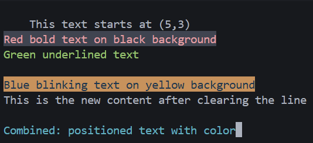

# 实验二：内核printf与清屏功能实现
文件列表如下：
```text
.
├── kernel
│   ├── defs.h
│   ├── types.h
│   ├── entry.S
│   ├── printf.c
│   ├── console.c
│   ├── start.c
│   ├── main.c
│   └── uart.c
├── kernel.ld
└── Makefile
```
## 1、新增各模块关系
printf提供解析格式字符串转换为字符串的功能，console提供控制台输出、统一的字符输出接口，uart提供串口输出功能。三层的架构更利于功能的维护与拓展
## 2、console.c
console.c提供控制台输出功能，通过uart.c的uart_putc()实现。首先consputc函数通过uart_putc()将字符输出到串口，我直接搬的源码。
```c
void
consputc(int c)
{
  if(c == BACKSPACE){
    // 如果用户输入退格，用空格覆盖并再次退格
    uart_putc('\b');
    uart_putc(' ');
    uart_putc('\b');
  } else {
    uart_putc(c);
  }
}
```
而控制台的初始化也就是通过uart_init()函数来初始化UART硬件。
```c
void
consoleinit(void)
{
  uartinit();
}
```
通过ANSI转义序列来实现清屏功能 \033[2J  清除整个屏幕  \033[H 光标回到左上角
```c
void clear_screen(void)
{
  // \033[2J 清屏，\033[H 将光标移动到左上角
  consputc('\033');
  consputc('[');
  consputc('2');
  consputc('J');

  consputc('\033');
  consputc('[');
  consputc('H');
}
```
使用ANSI转义序列 \033[y;xH 实现光标定位,将输入的数字转换为字符进行输出。
```c
void
goto_xy(int x, int y)
{
  // ANSI 转义序列: \033[y;xH
  consputc('\033');
  consputc('[');
  
  // 转换行号
  if(y >= 10) {
    consputc('0' + y/10);
    consputc('0' + y%10);
  } else {
    consputc('0' + y);
  }
  
  consputc(';');
  
  // 转换列号
  if(x >= 10) {
    consputc('0' + x/10);
    consputc('0' + x%10);
  } else {
    consputc('0' + x);
  }
  
  consputc('H');
}
```
使用ANSI转义序列 \033[2K 清除整行，发送回车符 \r 将光标移回行首
```c
void
clear_line(void)
{
  // ANSI 转义序列: \033[2K
  consputc('\033');
  consputc('[');
  consputc('2');
  consputc('K');
  
  // 将光标移回行首
  consputc('\r');
}
```
set_color 函数用于设置颜色和属性参数分别表示前景色、背景色和属性。使用ANSI转义序列 \033[attr;3x;4ym 设置颜色：
attr: 文本属性 (0=重置, 1=粗体, 4=下划线等)但并未实现
3x: 前景色 (30-37对应不同颜色)
4y:保持接口一致性 背景色 (240-47对应不同颜色)
```c
// 颜色定义
#define COLOR_BLACK   0
#define COLOR_RED     1
#define COLOR_GREEN   2
#define COLOR_YELLOW  3
#define COLOR_BLUE    4
#define COLOR_MAGENTA 5
#define COLOR_CYAN    6
#define COLOR_WHITE   7

void
set_color(int fg, int bg,)
{
  // ANSI 转义序列: \033[attr;fg;bgm
  consputc('\033');
  consputc('[');
  consputc('0');
  
  // 前景色
  if(fg >= 0) {
    consputc(';');
    consputc('3');
    consputc('0' + fg);
  }
  
  // 背景色
  if(bg >= 0) {
    consputc(';');
    consputc('4');
    consputc('0' + bg);
  }
  
  consputc('m');
}
```

## 3、printf.c
对于printf.c提供了解析格式字符串转换数字的功能。首先的printint和printptr我直接使用了xv6的源码，这两个函数分别是将整数转换为指定进制的字符串并输出，以十六进制格式打印指针地址
```c
static void
printint(int xx, int base, int sign)
{
    char buf[16];
    int i;
    uint x;

    if (sign && (sign = (xx < 0)))
        x = -xx;
    else
        x = xx;

    i = 0;
    do
    {
        buf[i++] = digits[x % base];
    } while ((x /= base) != 0);

    if (sign)
        buf[i++] = '-';

    while (--i >= 0)
        consputc(buf[i]);
}

static void
printptr(uint64 x)
{
    int i;
    consputc('0');
    consputc('x');
    for (i = 0; i < (sizeof(uint64) * 2); i++, x <<= 4)
        consputc(digits[x >> (sizeof(uint64) * 8 - 4)]);
}
```
printf函数支持基本数据类型的格式化输出 通过遍历格式字符串`fmt`识别格式说明符
- 使用`switch`语句处理不同的格式字符：
  - `%d`：调用`printint`以十进制格式打印整数
  - `%x`：调用`printint`以十六进制格式打印整数
  - `%p`：调用`printptr`打印指针地址
  - `%s`：逐字符打印字符串
  - `%c`：打印单个字符
  - `%%`：打印百分号本身
```c
void printf(char *fmt, ...)
{
    va_list ap;
    int i, c;
    char *s;

    va_start(ap, fmt);
    for (i = 0; (c = fmt[i] & 0xff) != 0; i++)
    {
        if (c != '%')
        {
            consputc(c);
            continue;
        }
        c = fmt[++i] & 0xff;
        if (c == 0)
            break;
        switch (c)
        {
        case 'd':
            printint(va_arg(ap, int), 10, 1);
            break;
        case 'x':
            printint(va_arg(ap, int), 16, 0);
            break;
        case 'p':
            printptr(va_arg(ap, uint64));
            break;
        case 's':
            if ((s = va_arg(ap, char *)) == 0)
                s = "(null)";
            for (; *s; s++)
                consputc(*s);
            break;
        case 'c':
            // 从可变参数中获取字符并打印
            consputc((char)va_arg(ap, int));
            break;
        case '%':
            consputc('%');
            break;
        default:
            // 打印未知 % 序列以引起注意
            consputc('%');
            consputc(c);
            break;
        }
    }
    va_end(ap);
}
```
printf_color的实现比printf多了一个调用console中setcolor的函数来设置字体颜色和背景颜色
```c
void printf_color(int fg, int bg, char *fmt, ...)
{
    va_list ap;
    int i, c;
    char *s;

    // 设置颜色
    set_color(fg, bg);

    va_start(ap, fmt);
    for (i = 0; (c = fmt[i] & 0xff) != 0; i++)
    {
        if (c != '%')
        {
            consputc(c);
            continue;
        }
        c = fmt[++i] & 0xff;
        if (c == 0)
            break;
        switch (c)
        {
        case 'd':
            printint(va_arg(ap, int), 10, 1);
            break;
        case 'x':
            printint(va_arg(ap, int), 16, 0);
            break;
        case 'p':
            printptr(va_arg(ap, uint64));
            break;
        case 's':
            if ((s = va_arg(ap, char *)) == 0)
                s = "(null)";
            for (; *s; s++)
                consputc(*s);
            break;
        case 'c':
            // 从可变参数中获取字符并打印
            consputc((char)va_arg(ap, int));
            break;
        case '%':
            consputc('%');
            break;
        default:
            // 打印未知 % 序列以引起注意
            consputc('%');
            consputc(c);
            break;
        }
    }
    va_end(ap);

    // 重置颜色
    set_color(-1, -1);
}
```
## 4、测试函数
```c
void printf_test()
{
    consoleinit();
    // 清屏
    clear_screen();

    // 测试光标定位
    goto_xy(5, 3); // 移动到第3行第5列
    printf("This text starts at (5,3)");
    // 测试颜色输出
    printf_color(COLOR_RED, COLOR_BLACK, "\nRed bold text on black background\n");
    printf_color(COLOR_GREEN, -1, "Green underlined text\n");
    printf_color(COLOR_BLUE, COLOR_YELLOW, "\nBlue blinking text on yellow background\n");

    // 测试清除行
    printf("This is a long line that will be partially cleared...");
    clear_line();
    printf("This is the new content after clearing the line\n");

    // 组合使用功能
    goto_xy(1, 10); // 移动到第10行第1列
    printf_color(COLOR_CYAN, -1, "Combined: positioned text with color");
}
```
测试结果如下：
