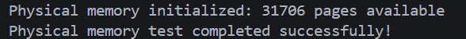
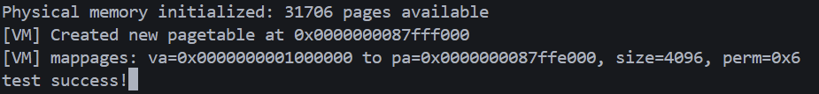
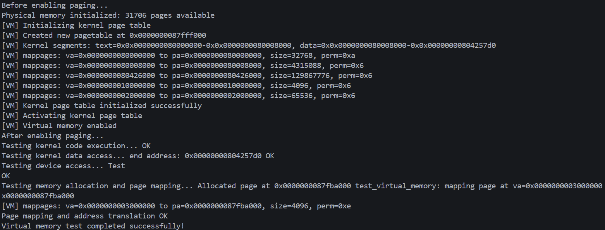

# 实验三：页表与内存管理
文件列表如下：
```text
.
├── kernel
│   ├── defs.h
│   ├── types.h
│   ├── param.h
│   ├── entry.S
│   ├── printf.c
│   ├── console.c
│   ├── start.c
│   ├── main.c
│   ├── memlayout.h
│   ├── kalloc.c
│   ├── vm.c
│   ├── string.c
│   ├── assert.h
|   ├── riscv.h
│   └── uart.c
├── kernel.ld
└── Makefile
```
## 1、新增各模块简介
riscv.h定义了RISC-V架构的相关定义，比如页面大小、页表项标志位等，kalloc.c主要是实现了物理内存的分配和释放，管理空闲页链表，vm.c主要建立和管理虚拟地址到物理地址的映射关系。
## 2、riscv.h
riscv.h声明了页面管理的相关定义，页表项标志位的定义，页表操作宏，以及部分操作函数。我是直接套用的xv6的源码，选择了我需要的部分。
```c
#include "types.h"
#define PGSIZE 4096 // bytes per page
#define PGSHIFT 12  // bits of offset within a page

#define PGROUNDUP(sz) (((sz) + PGSIZE - 1) & ~(PGSIZE - 1))
#define PGROUNDDOWN(a) (((a)) & ~(PGSIZE - 1))
// 页表项标志位
#define PTE_V (1L << 0) // 有效位
#define PTE_R (1L << 1) // 可读
#define PTE_W (1L << 2) // 可写
#define PTE_X (1L << 3) // 可执行
#define PTE_U (1L << 4) // 用户可访问

// 页表项操作
#define PTE2PA(pte) (((pte) >> 10) << 12)
#define PA2PTE(pa) ((((uint64)pa) >> 12) << 10)
#define PTE_FLAGS(pte) ((pte) & 0x3FF)

// Sv39 相关
#define SATP_SV39 (8L << 60)
#define MAKE_SATP(pagetable) (SATP_SV39 | (((uint64)pagetable) >> 12))

// 寄存器读写函数
static inline uint64
r_satp()
{
    uint64 x;
    asm volatile("csrr %0, satp" : "=r"(x));
    return x;
}

static inline void
w_satp(uint64 x)
{
    asm volatile("csrw satp, %0" : : "r"(x));
}

static inline void
sfence_vma()
{
    asm volatile("sfence.vma zero, zero");
}

// 其他 CSR 操作函数可以根据需要添加
static inline void
w_mstatus(uint64 x)
{
    asm volatile("csrw mstatus, %0" : : "r"(x));
}
```
## 3、kalloc.c
pmem_init()函数将物理内存区域分区并通过调用free_page将每一页加入到空闲链表中。
```c
void pmem_init(void)
{
    // initlock(&kmem.lock, "kmem");

    // 初始化统计信息
    kmem.total_pages = 0;
    kmem.allocated_pages = 0;
    kmem.free_pages = 0;

    // 从内核结束地址到PHYSTOP的内存加入空闲链表
    char *p = (char *)PGROUNDUP((uint64)end);
    for (; p + PGSIZE <= (char *)PHYSTOP; p += PGSIZE)
    {
        free_page(p);
        kmem.total_pages++;
    }

    kmem.free_pages = kmem.total_pages;
    printf("Physical memory initialized: %d pages available\n", kmem.free_pages);
}
```
alloc_page()函数分配单个物理页面，从空闲链表中取出第一个页，并将其从链表中删除，同时更新分配的统计信息，最后返回页面地址。
```c
void *alloc_page(void)
{
    struct run *r;

    // acquire(&kmem.lock);
    r = kmem.freelist;
    if (r)
    {
        kmem.freelist = r->next;
        kmem.allocated_pages++;
        kmem.free_pages--;
    }
    // release(&kmem.lock);

    if (r)
    {
        // 填充调试模式值，帮助检测未初始化内存
        memset((char *)r, 0xAA, PGSIZE);
    }

    return (void *)r;
}
```
alloc_pages()函数分配多个物理页面，从空闲链表中取出指定数量的页，并将其从链表中删除，更新分配的统计信息，最后返回第一个页的地址。每次先分配第一个页面，然后依次分配后续页面并检查是否物理地址连续。若发现不连续，则释放已分配的页面重新尝试。
```c
void *alloc_pages(int n)
{
    if (n <= 0)
        return 0;

    if (n == 1)
        return alloc_page();

    void *pages[n];
    int consecutive = 0;

    for (int attempt = 0; attempt < 10; attempt++)
    { // 最多尝试10次
        // 分配第一页
        pages[0] = alloc_page();
        if (!pages[0])
            return 0;

        // 尝试分配连续的后续页面
        consecutive = 1;
        for (int i = 1; i < n; i++)
        {
            pages[i] = alloc_page();
            if (!pages[i] ||
                (uint64)pages[i] != (uint64)pages[i - 1] + PGSIZE)
            {
                // 不连续，释放已分配的页面
                for (int j = 0; j < consecutive; j++)
                {
                    free_page(pages[j]);
                }
                consecutive = 0;
                break;
            }
            consecutive++;
        }

        if (consecutive == n)
        {
            return pages[0]; // 成功分配到连续页面
        }
    }

    return 0; // 多次尝试后仍失败
}
```
free_page()函数释放单个物理页面，先对释放的物理页面进行多项安全检查，然后将页面内容清零，之后将当前页面设置为新的空闲页链表头结点。
```c
void free_page(void *pa)
{
    struct run *r;

    // 参数检查
    if (!pa)
        panic("free_page: null pointer");

    if (((uint64)pa % PGSIZE) != 0)
        panic("free_page: not page aligned");

    if ((char *)pa < end || (uint64)pa >= PHYSTOP)
        panic("free_page: out of range");

    // 安全检查：清空页面内容，防止信息泄漏
    memset(pa, 0, PGSIZE);

    r = (struct run *)pa;

    // acquire(&kmem.lock);
    r->next = kmem.freelist;
    kmem.freelist = r;
    kmem.allocated_pages--;
    kmem.free_pages++;
    // release(&kmem.lock);
}
```
## 4、vm.c
首先vm.c定义了页表项和页表类型，内核页表指针，各宏定义和页表统计结构体。
```c
// 页表类型定义
typedef uint64 pte_t;
typedef uint64 *pagetable_t;

// 全局内核页表
pagetable_t kernel_pagetable;

// 虚拟地址空间限制（Sv39规范）
#define MAXVA (1L << (9 + 9 + 9 + 12 - 1))

// 从虚拟地址提取各级VPN
#define VPN_SHIFT(level) (12 + 9 * (level))
#define VPN(va, level) (((va) >> VPN_SHIFT(level)) & 0x1FF)

static struct pagetable_stats pt_stats;
```
vm.c使用walk()来遍历整个页表，根据虚拟地址查找对应的页表项，并返回页表项的指针，也提供了分配新页表的功能。检查虚拟地址是否超出最大范围,遍历三级页表,如果页表项有效则进入下一级，否则根据alloc参数决定是否分配新页表,返回最后一级页表中对应项的指针.
```c
pte_t *
walk(pagetable_t pagetable, uint64 va, int alloc)
{
    if (va >= MAXVA)
    {
        vm_debug("walk: virtual address %p too large\n", va);
        return 0;
    }

    for (int level = 2; level > 0; level--)
    {
        pte_t *pte = &pagetable[VPN(va, level)];

        if (*pte & PTE_V)
        {
            // 页表项有效，进入下一级
            pagetable = (pagetable_t)PTE2PA(*pte);
        }
        else
        {
            // 页表项无效
            if (!alloc)
            {
                return 0;
            }

            // 分配新页表
            pagetable = (pagetable_t)alloc_page();
            if (pagetable == 0)
            {
                vm_debug("walk: kalloc failed for level %d page table\n", level);
                return 0;
            }

            // 清零新页表
            memset(pagetable, 0, PGSIZE);
            pt_stats.total_pt_pages++;

            // 设置父页表项
            *pte = PA2PTE(pagetable) | PTE_V;
        }
    }

    return &pagetable[VPN(va, 0)];
}
```
walk_lookup仅查找页表项，不创建新的页表。
```c
pte_t *
walk_lookup(pagetable_t pagetable, uint64 va)
{
    return walk(pagetable, va, 0);
}
```
walk_create()创建并分配新的页表项。
```c
pte_t *
walk_create(pagetable_t pagetable, uint64 va)
{
    return walk(pagetable, va, 1);
}
```
create_pagetable()创建空页表。
```c
pagetable_t
create_pagetable(void)
{
    pagetable_t pagetable = (pagetable_t)alloc_page();
    if (pagetable == 0)
    {
        vm_debug("create_pagetable: kalloc failed\n");
        return 0;
    }

    memset(pagetable, 0, PGSIZE);
    pt_stats.total_pt_pages++;

    vm_debug("Created new pagetable at %p\n", pagetable);
    return pagetable;
}
```
mappages()函数将物理页面映射到虚拟地址空间。对地址按页对齐处理,遍历每一页，调用walk_create()创建页表项,检查是否已映射，避免重复映射,建立映射关系并设置权限。map_page()函数调用mappages实现单页映射，unmap_page()函数调用walk_lookup()实现单页取消映射。
```c
int mappages(pagetable_t pagetable, uint64 va, uint64 size, uint64 pa, int perm)
{
    uint64 a, last;
    pte_t *pte;

    if (size == 0)
    {
        vm_debug("mappages: zero size\n");
        return -1;
    }

    a = PGROUNDDOWN(va);
    last = PGROUNDDOWN(va + size - 1);

    vm_debug("mappages: va=%p to pa=%p, size=%d, perm=0x%x\n",
             va, pa, size, perm);

    for (;;)
    {
        // 查找或创建页表项
        if ((pte = walk_create(pagetable, a)) == 0)
        {
            vm_debug("mappages: walk_create failed for va=%p\n", a);
            return -1;
        }

        // 检查是否已映射
        if (*pte & PTE_V)
        {
            vm_debug("mappages: remap detected at va=%p\n", a);
            return -1;
        }

        // 建立映射
        if (perm & PTE_U)
        {
            *pte = PA2PTE(pa) | perm | PTE_V;
        }
        else
        {
            *pte = PA2PTE(pa) | perm | PTE_V;
        }

        pt_stats.total_mappings++;

        if (a == last)
        {
            break;
        }
        a += PGSIZE;
        pa += PGSIZE;
    }

    return 0;
}

int map_page(pagetable_t pagetable, uint64 va, uint64 pa, int perm)
{
    return mappages(pagetable, va, PGSIZE, pa, perm);
}

void unmap_page(pagetable_t pagetable, uint64 va)
{
    pte_t *pte = walk_lookup(pagetable, va);
    if (pte == 0)
    {
        return;
    }

    if (*pte & PTE_V)
    {
        *pte = 0; // 清除页表项
        pt_stats.total_mappings--;

        // 注意：这里不释放物理页面，由调用者负责
        vm_debug("unmap_page: unmapped va=%p\n", va);
    }
}
```
free_pagetable_recursive()递归释放页表，遍历页表所有512个项，如果是中间级页表且有效，则递归释放下级页表。destroy_pagetable() 调用free_pagetable_recursive()销毁页表。
```c
static void
free_pagetable_recursive(pagetable_t pagetable, int level)
{
    // 遍历所有512个页表项
    for (int i = 0; i < 512; i++)
    {
        pte_t pte = pagetable[i];
        if (pte & PTE_V)
        {
            if (level > 0)
            {
                // 中间级页表，递归释放
                free_pagetable_recursive((pagetable_t)PTE2PA(pte), level - 1);
            }
            // 注意：不释放叶子节点指向的物理页面
        }
    }

    // 释放当前页表页面
    free_page((void *)pagetable);
    pt_stats.total_pt_pages--;
}


void destroy_pagetable(pagetable_t pagetable)
{
    if (pagetable == 0)
    {
        return;
    }

    vm_debug("destroy_pagetable: freeing pagetable %p\n", pagetable);
    free_pagetable_recursive(pagetable, 2); // Sv39有3级，从第2级开始
}
```
walkaddr()实现虚拟地址到物理地址转换。首先使用walk_lookup()查找页表项，然后检查页表项是否有效，最后提取物理页地址并加上页内偏移。
```c
uint64
walkaddr(pagetable_t pagetable, uint64 va)
{
    pte_t *pte;
    uint64 pa;

    if (va >= MAXVA)
    {
        return 0;
    }

    pte = walk_lookup(pagetable, va);
    if (pte == 0)
    {
        return 0;
    }

    if ((*pte & PTE_V) == 0)
    {
        return 0;
    }

    pa = PTE2PA(*pte);

    // 加上页内偏移
    pa |= (va & (PGSIZE - 1));

    return pa;
}
```
kvminit()初始化内核页表，kvminithart()激活内核页表。
```c
void kvminit(void)
{
    vm_debug("Initializing kernel page table\n");

    kernel_pagetable = create_pagetable();
    if (kernel_pagetable == 0)
    {
        panic("kvminit: create_pagetable failed");
    }

    pt_stats.kernel_pt_pages = 1; // 根页表

    // 获取内核段边界（这些符号在链接脚本中定义）
    extern char etext[]; // 内核代码结束
    extern char end[];   // 内核数据结束

    vm_debug("Kernel segments: text=0x%p-0x%p, data=0x%p-0x%p\n",
             KERNBASE, etext, etext, end);

    // 映射内核代码段 (R+X权限)
    if (mappages(kernel_pagetable, KERNBASE, (uint64)etext - KERNBASE,
                 KERNBASE, PTE_R | PTE_X) < 0)
    {
        panic("kvminit: kernel text mapping failed");
    }

    // 映射内核数据段 (R+W权限)
    uint64 data_start = PGROUNDUP((uint64)etext); // 从下一个页面边界开始
    if (data_start < (uint64)end)
    { // 只有在有数据段需要映射时才映射
        if (mappages(kernel_pagetable, data_start, (uint64)end - data_start,
                     data_start, PTE_R | PTE_W) < 0)
        {
            panic("kvminit: kernel data mapping failed");
        }
    }

    // 映射剩余的物理内存
    uint64 remaining_start = PGROUNDUP((uint64)end);
    if (remaining_start < PHYSTOP)
    {
        if (mappages(kernel_pagetable, remaining_start, PHYSTOP - remaining_start,
                     remaining_start, PTE_R | PTE_W) < 0)
        {
            panic("kvminit: remaining memory mapping failed");
        }
    }

    // 映射设备内存
    // UART
    if (mappages(kernel_pagetable, UART0, PGSIZE, UART0, PTE_R | PTE_W) < 0)
    {
        panic("kvminit: UART mapping failed");
    }

    vm_debug("Kernel page table initialized successfully\n");
}

/**
 * 激活内核页表
 */
void kvminithart(void)
{
    vm_debug("Activating kernel page table\n");

    // 写入SATP寄存器
    w_satp(MAKE_SATP(kernel_pagetable));

    // 刷新TLB
    sfence_vma();

    vm_debug("Virtual memory enabled\n");
}
```
## 5、测试函数
首先测试物理内存基本分配和释放
```c
void test_physical_memory(void)
{
    pmem_init();
    // 测试基本分配和释放
    void *page1 = alloc_page();
    void *page2 = alloc_page();
    assert(page1 != page2);
    assert(((uint64)page1 & 0xFFF) == 0); // 页对齐检查
    // 测试数据写入
    *(int *)page1 = 0x12345678;
    assert(*(int *)page1 == 0x12345678);
    // 测试释放和重新分配
    free_page(page1);
    void *page3 = alloc_page();
    // page3可能等于page1（取决于分配策略）
    free_page(page2);
    free_page(page3);
    printf("Physical memory test completed successfully!\n");
}
```
测试结果如下：

然后测试页表基本映射、地址转换和权限位
```c
void test_pagetable(void)
{
    pmem_init();
    pagetable_t pt = create_pagetable();
    // 测试基本映射
    uint64 va = 0x1000000;
    uint64 pa = (uint64)alloc_page();
    assert(map_page(pt, va, pa, PTE_R | PTE_W) == 0);
    // 测试地址转换
    pte_t *pte = walk_lookup(pt, va);
    assert(pte != 0 && (*pte & PTE_V));
    assert(PTE2PA(*pte) == pa);
    // 测试权限位
    assert(*pte & PTE_R);
    assert(*pte & PTE_W);
    assert(!(*pte & PTE_X));
    printf("test success!");
}
```
测试结果如下：

最后测试虚拟地址空间映射
```c
void test_virtual_memory(void)
{
    printf("Before enabling paging...\n");

    // 初始化物理内存管理器
    pmem_init();

    // 启用分页
    kvminit();
    kvminithart();

    printf("After enabling paging...\n");

    // 测试内核代码仍然可执行
    // 通过调用一个函数来验证代码执行正常
    printf("Testing kernel code execution... ");
    consoleinit();
    printf("OK\n");

    // 测试内核数据仍然可访问
    // 通过访问全局变量来验证数据访问正常
    printf("Testing kernel data access... ");
    extern char end[];
    printf("end address: %p ", end);
    printf("OK\n");

    // 测试设备访问仍然正常
    // 通过调用UART函数来验证设备访问正常
    printf("Testing device access... ");
    uartinit();
    uart_putc('T');
    uart_putc('e');
    uart_putc('s');
    uart_putc('t');
    uart_putc('\n');
    printf("OK\n");

    // 测试内存分配和页表操作
    printf("Testing memory allocation and page mapping... ");
    void *page = alloc_page();
    assert(page != 0);
    printf("Allocated page at %p ", page);

    // 测试页表映射
    // 注意：0x2000000 区域在内核初始化时被用于 CLINT 设备映射，
    // 直接使用该地址会导致 remap 失败。这里选择一个未被占用的虚拟地址，
    // 并在遇到已映射页时向后寻找一个空闲页。
    uint64 va = 0x3000000;    // 起始虚拟地址候选
    uint64 pa = (uint64)page; // 物理地址
    extern pagetable_t kernel_pagetable;

    // 查找未被映射的虚拟页，最多尝试 1024 页（安全上限）
    int tries = 0;
    while (walkaddr(kernel_pagetable, va) != 0 && tries < 1024)
    {
        va += PGSIZE;
        tries++;
    }
    if (tries >= 1024)
    {
        panic("test_virtual_memory: cannot find free virtual page to map");
    }
    printf("test_virtual_memory: mapping page at va=%p -> pa=%p\n", va, pa);
    assert(map_page(kernel_pagetable, va, pa, PTE_R | PTE_W | PTE_X) == 0);

    // 测试地址转换
    uint64 converted_pa = walkaddr(kernel_pagetable, va);
    assert(converted_pa == pa);

    printf("Page mapping and address translation OK\n");

    printf("Virtual memory test completed successfully!\n");
}
```
测试结果如下：
