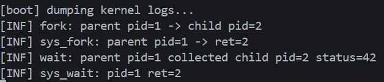
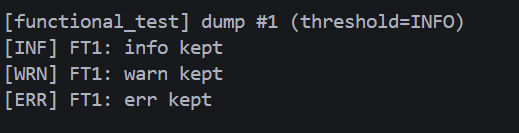
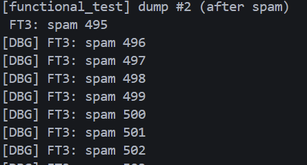
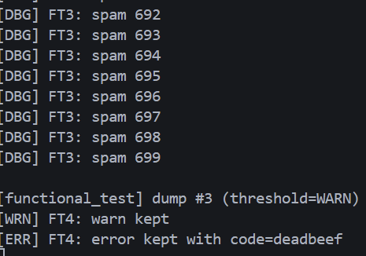

# 实验八：日志系统

文件列表如下：

```text
.
├── kernel
│   ├── defs.h
│   ├── types.h
│   ├── param.h
│   ├── entry.S
│   ├── printf.h
│   ├── printf.c
│   ├── console.c
│   ├── start.c
│   ├── main.c
│   ├── memlayout.h
│   ├── kalloc.c
│   ├── vm.h
│   ├── vm.c
│   ├── string.c
│   ├── assert.h
│   ├── riscv.h
│   ├── spinlock.c
│   ├── spinlock.h
│   ├── kernelvec.S
│   ├── trampoline.S
│   ├── swtch.S
│   ├── trap.c
│   ├── proc.h
│   ├── proc.c
│   ├── process_api.c
│   ├── syscall.h
│   ├── syscall.c
│   ├── sync_test.c
│   ├── uart.c
│   ├── bio.c
│   ├── fs.h
│   ├── fs.c
│   ├── file.c
│   ├── log.h
│   └── log.c
├── kernel.ld
├── Makefile
├── lab8.md
└── results/
```


## 1、新增各模块简介

本实验实现一个高性能、结构化、可配置的内核日志框架：

- **日志接口与缓冲**：[kernel/log.h](kernel/log.h)、[kernel/log.c](kernel/log.c)
  - 定义日志级别常量、环形缓冲 `klog_buffer`、全局阈值 `current_log_level`。
  - 提供 `klog_init()` 初始化、`klog(level, fmt, ...)` 写入、`klog_read()` 读取缓冲、`klog_dump_to_console()` 导出到控制台。
- **系统调用与读取接口**：[kernel/syscall.h](kernel/syscall.h)、[kernel/syscall.c](kernel/syscall.c)、[user/usys.S](user/usys.S)
  - 注册 `SYS_klog` 并实现 `sys_klog()`，支持用户态安全读取日志（实验可选）。
- **关键路径集成**：在 [kernel/proc.c](kernel/proc.c)、[kernel/syscall.c](kernel/syscall.c)、[kernel/file.c](kernel/file.c) 中插入 `klog()`，记录进程生命周期与系统调用要点。
- **构建与运行**：[Makefile](Makefile)
  - 通过 `make run` 启动 QEMU 观察控制台日志（无需用户态 `logread`）。


## 2、核心数据结构（log.h）

- **日志级别与常量**：
  - `LOG_LEVEL_DEBUG/INFO/WARN/ERROR/FATAL`（0~4），控制信噪比与过滤。
  - `LOG_BUF_SIZE=4096`、`MAX_LOG_LEN=256`。
- **环形缓冲 `klog_buffer`**：自旋锁保护，固定容量，读写指针，写满自动覆盖最旧数据。
- **接口原型**：`klog_init()`、`klog()`、`klog_read()`、`klog_dump_to_console()`。

示意定义：

```c
#define LOG_LEVEL_DEBUG 0
#define LOG_LEVEL_INFO  1
#define LOG_LEVEL_WARN  2
#define LOG_LEVEL_ERROR 3
#define LOG_LEVEL_FATAL 4

#define LOG_BUF_SIZE 4096
#define MAX_LOG_LEN  256

struct klog_buffer {
    struct spinlock lock;
    char buf[LOG_BUF_SIZE];
    int read_pos;
    int write_pos;
};

extern struct klog_buffer log_buf;
extern int current_log_level;
```


## 3、环形缓冲与写入（log.c）

- **初始化**：`klog_init()` 设置锁与读写指针为 0。
- **可读字节计算**：`klog_readable_bytes()` 根据读写指针距离返回当前缓冲可读数据量。
- **写入字节**：`klog_write_bytes(s,len)` 逐字节写入并移动 `write_pos`，若追上 `read_pos` 则前移读指针实现覆盖。
- **轻量格式化**：`kvsnprintf(out,sz,fmt,ap)` 支持 `%d/%x/%p/%s/%%`，避免引入完整 libc；`klog()` 在过滤通过后调用该格式化并统一加前缀 `[DBG/INF/WRN/ERR/FTL]` 与换行。
- **导出到控制台**：`klog_dump_to_console()` 在持锁状态下逐字节取出并通过 UART 输出，便于在无用户态时验证。
- **读取到内核缓冲**：`klog_read(dst,n)` 读取不超过当前可读量的字节到内核缓冲，供 `sys_klog()` 使用。

示意写入流程：

```c
void klog(int level, const char *fmt, ...) {
  if (level < current_log_level) return; // 尽早过滤，降低开销
  char line[MAX_LOG_LEN];
  va_list ap; va_start(ap, fmt);
  int n = kvsnprintf(line, MAX_LOG_LEN, fmt, ap);
  va_end(ap);
  const char *prefix = "[INF] "; // 根据级别选择前缀
  acquire(&log_buf.lock);
  klog_write_bytes(prefix, strlen(prefix));
  klog_write_bytes(line, n);
  klog_write_bytes("\n", 1);
  release(&log_buf.lock);
}
```


## 4、系统调用与用户接口（syscall.c / usys.S）

- **系统调用**：`sys_klog(void)` 从环形缓冲读取至内核临时区，再 `copyout_user()` 到用户缓冲（单次最多 1024 字节，非阻塞）。
- **用户态桩**：在 [user/usys.S](user/usys.S) 中提供 `klog` 号的入口。
- **用户工具（可选）**：有 [user/logread.c](user/logread.c) 持续读取并打印，但本实验验证可直接依赖 `klog_dump_to_console()`，不需要用户态工具。

核心实现（节选）：

```c
static uint64 sys_klog(void) {
  uint64 ubuf; int n;
  argaddr(0, &ubuf); argint(1, &n);
  if (n <= 0) return 0; if (n > 1024) n = 1024;
  char tmp[1024]; int r = klog_read(tmp, n);
  if (r <= 0) return r;
  if (copyout_user(myproc()->pagetable, ubuf, tmp, r) < 0) return -1;
  return r;
}
```


## 5、关键路径集成（proc.c / syscall.c / file.c）

- **进程生命周期**：[kernel/proc.c](kernel/proc.c)
  - `allocproc()`：`[DBG] allocproc: pid=...`
  - `fork()`：失败 `[ERR]`；成功 `[INF] fork: parent pid=... -> child pid=...]`
  - `exit()`：`[WRN] exit: pid=... status=...`
  - `wait()`：`[INF] wait: parent pid=... collected child pid=... status=...]`
- **系统调用入口**：[kernel/syscall.c](kernel/syscall.c)
  - `sys_write()`：`[DBG] sys_write: fd=... n=...`（INFO 阈值下被过滤）
  - `sys_fork()`：`[INF] sys_fork: parent pid=... -> ret=...]`
  - `sys_wait()`：`[INF] sys_wait: pid=... ret=...]`
  - `sys_exit()`：`[INF] sys_exit: pid=... status=...]`
- **文件层**：[kernel/file.c](kernel/file.c)
  - `fileread()/filewrite()`：`[DBG]` 记录 inum/off/n/r 等关键信息（INFO 阈值下被过滤）。


## 6、测试结果

在 QEMU 运行下观察日志系统行为（无需 `logread`）：

```bash
make clean
make run
```

- **系统调用与进程日志**：在 INFO 阈值下，DEBUG 被过滤，其它级别可见。
- **阈值控制**：将 `current_log_level` 设为 `LOG_LEVEL_DEBUG` 可显示更多调试信息（如 `sys_write`、`allocproc` 与 `fileread/filewrite`）。
- **环形覆盖**：大量 DEBUG 写入会覆盖最旧数据，仅保留最近 4096B 的日志，保证在压力场景下仍能记录最新事件。

```c
void klog_test()
{
  // 初始化日志系统并设置默认级别
  klog_init();
  extern int current_log_level;
  current_log_level = LOG_LEVEL_INFO; // 默认显示 INFO 及以上

  // 运行系统调用测试（会生成日志）
  test_syscall();
  test_syscall_fork();

  // 导出缓冲区日志到控制台，便于观察
  printf("\n[boot] dumping kernel logs...\n");
  klog_dump_to_console();
}
```
测试结果如下:


- **功能测试**：长消息、批量写入触发环形覆盖、阈值切换

```c
static void klog_functional_test(void)
{
  uartinit();
  consoleinit();
  klog_init();

  extern int current_log_level;
  current_log_level = LOG_LEVEL_INFO;
  klog(LOG_LEVEL_DEBUG, "FT1: debug filtered");
  klog(LOG_LEVEL_INFO,  "FT1: info kept");
  klog(LOG_LEVEL_WARN,  "FT1: warn kept");
  klog(LOG_LEVEL_ERROR, "FT1: err kept");

  // 长消息与占位符
  current_log_level = LOG_LEVEL_DEBUG;
  klog(LOG_LEVEL_DEBUG, "FT2: long %s %d %x %p %% end",
    "abcdefghijklmnopqrstuvwxyz0123456789", 12345, 0xabcdeu, (void*)0xfeedbeef);

  // 批量 DEBUG 触发覆盖（4096B 环形缓冲仅保留最新内容）
  for (int i = 0; i < 700; i++)
    klog(LOG_LEVEL_DEBUG, "FT3: spam %d", i);

  // 阈值调整到 WARN：过滤 INFO/DEBUG，仅保留重要信息
  current_log_level = LOG_LEVEL_WARN;
  klog(LOG_LEVEL_INFO,  "FT4: info filtered");
  klog(LOG_LEVEL_WARN,  "FT4: warn kept");
  klog(LOG_LEVEL_ERROR, "FT4: error kept code=%x", 0xdeadbeef);
}
```
测试结果如下:




