# 实验一：RISC-V 引导与裸机启动

**姓名**：顾桐舟

**学号**：2023302111342

## 一、实验概述

### 实验目标
实现 RISC-V 裸机引导与最小内核启动，完成串口（UART）驱动并在 QEMU 中通过 UART 输出启动信息用于验证启动流程。

### 完成情况
- ✅ 实现启动汇编（`kernel/entry.S`），设置栈并跳转到 C 语言入口
- ✅ 编写链接脚本（`kernel.ld`），确定内核内存布局
- ✅ 实现 `start.c`，完成 .bss 清零、设备初始化并调用 `main()`
- ✅ 实现 UART 驱动（`kernel/uart.c`）并提供 `uart_puts` 输出功能
- ⚠️ 未实现 trampoline / 用户态切换（本次实验仅限内核启动与串口输出）

### 开发环境
- 操作系统：Linux
- 工具链：riscv64-unknown-elf-gcc
- QEMU：qemu-system-riscv64
- 参考文件：`Makefile`, `kernel.ld`。

## 二、技术设计

### 系统架构

启动流程分为三步：

- 硬件/模拟器加载内核镜像到内存并跳转到 `_entry`（`kernel/entry.S`）
- 汇编做最小初始化（设置 `sp`），调用 `start()`（`start.c`）
- C 端完成 `.bss` 清零、外设初始化（UART），并调用 `main()` 进入内核主逻辑

与 xv6 的对比：本实验实现为单核、简化的启动流程；未实现用户态、trampoline 与多核初始化逻辑。

### 关键数据结构

本实验以启动与设备初始化为主，核心数据结构较少，主要为：

- `stack0`：在 `.bss` 中分配的内核栈缓存（通过数组分配固定大小的栈空间）
- UART 相关的寄存器偏移宏（`RHR, THR, LSR, LCR, IER` 等）用于读写串口

设计理由：通过简单固定栈与基础串口寄存器操作即可完成引导与串口输出的验证，便于逐步扩展。

### 核心流程与关键算法

核心启动流程（伪代码）：

```c
// entry.S: 设置 sp 并跳转
la sp, stack0
add sp, sp, 4096
call start

// start.c: C 端初始化
清零 .bss
uartinit();
uart_puts("Hello OS!\n");
main();
```

UART 输出流程：初始化 UART 寄存器、使能 FIFO，然后按字节写入 THR 寄存器，发送时等待 LSR 标志。

边界情况处理：串口发送函数 `uart_putc` 在写入前会轮询 `LSR_TX_IDLE`，确保不会丢失字符。

## 三、实现细节与关键代码

### 关键代码片段：`entry.S`

```s
.section .text
.global _entry
_entry:
    la sp, stack0
    li a0, 1024*4
    add sp, sp, a0
    call start
spin:
    j spin
```

说明：在汇编入口设置好内核栈并跳转到 `start()`，随后进入 C 端的初始化流程。

### 关键代码片段：`.bss` 清零与启动（`start.c`）

```c
extern char _bss_start[], _bss_end[];
__attribute__((aligned(16))) char stack0[4096];

void start() {
    for (char *p = _bss_start; p < _bss_end; p++) *p = 0;
    uartinit();
    uart_puts("Hello OS!\n");
    main();
}
```

说明：清零 `.bss` 防止未初始化全局变量带来不确定性；随后初始化串口并输出验证字符串。

### 关键代码片段：UART 驱动（`uart.c`）

```c
#define UART0 0x10000000L
#define LSR 5
#define LSR_TX_IDLE (1 << 5)
#define THR 0

void uart_putc(char c) {
    while ((*(volatile unsigned char*)(UART0 + LSR) & LSR_TX_IDLE) == 0) ;
    *(volatile unsigned char*)(UART0 + THR) = c;
}

void uart_puts(char *s) { while (*s) uart_putc(*s++); }
```

说明：基于寄存器轮询方式（简单、可靠）完成字符发送。

### 难点与实现抉择

- Stack 分配：直接在 `.bss` 中定义 `stack0[4096]`，实现简单明确，适合单核实验环境。
- 未实现 trampoline：本实验聚焦引导与串口，用户态切换留作后续实验扩展。

## 四、测试与验证

### 功能测试

测试通过在 QEMU 中运行镜像并观察串口输出，验证 `uart_puts("Hello OS!\n")` 能正确打印。

运行结果（截图）：


截图说明：QEMU 的串口输出窗口显示 `Hello OS!`，说明启动流程、UART 初始化与输出正常。


## 五、问题与总结

### 遇到的问题

- 未实现 trampoline 与用户态切换：本次实验仅完成内核启动与串口输出；后续需实现 trampoline 以支持用户程序与中断/系统调用切换。
- 暂未遇到其他问题。

### 实验收获

1. 理解了 RISC-V 裸机启动流程：从汇编入口到 C 语言初始化的全过程。
2. 熟悉了链接脚本和 `.bss` 清零的重要性，避免未初始化数据带来隐患。
3. 掌握串口（UART）的初始化与轮询发送实现，能通过 QEMU 串口验证内核输出。

### 改进方向

- 实现 trampoline 与用户态切换，完善中断与系统调用支持。
- 将串口驱动改为基于中断或环形缓冲区以提高吞吐量与效率。


# 实验二：内核 `printf` 与清屏功能实现


**姓名**：顾桐舟

**学号**：2023302111342

## 一、实验概述

### 实验目标
实现内核态的最小 `printf` 功能与控制台基本控制（清屏、光标定位、整行清除、颜色设置），用于内核启动日志与调试输出。

### 完成情况
- ✅ 分层输出架构（格式化层 → 控制台层 → 硬件层）
- ✅ 实现 `printf`（支持 `%d`, `%x`, `%p`, `%s`, `%c`, `%%`）及 `printf_color`
- ✅ 实现控制台命令：清屏、光标定位、清行、颜色设置与恢复
- ✅ 在 QEMU 串口中验证基本功能并保存测试截图

### 开发环境
- 操作系统：Linux
- 交叉编译工具链：riscv64-unknown-elf-gcc
- 模拟器：qemu-system-riscv64

## 二、技术设计

### 系统架构与设计理由
采用三层分离的设计：
- 格式化层：负责解析格式字符串并将字符送至控制台接口。
- 控制台层：封装终端控制序列（ANSI Escape），提供 `consputc` 等统一输出接口。
- 硬件层：直接操作 UART 寄存器完成字节发送（轮询方式）。

设计理由：分层便于替换后端（例如切换到显存输出）、便于对格式化逻辑、终端控制、设备驱动分别优化与测试。

### 与 xv6 的比较
- 相同点：数字转字符串（`printint`）实现思路借鉴 xv6：先将数转换为逆序字符缓冲，再反向输出；对负数边界（如 `INT_MIN`）的处理采用将有符号转为无符号的技巧。
- 不同点：本实现增加了基于 ANSI 转义序列的控制台功能（清屏、光标定位、颜色），便于教学演示；xv6 原始实现更偏向直接写字符到控制台/串口，不依赖终端的颜色控制序列。
- 兼容性：在支持 ANSI 的终端（如 QEMU 串口）可显示颜色与定位，非 ANSI 终端则可能仅展示原始转义字符。

### 核心算法与边界处理
- `printf` 采用单次线性扫描格式字符串，遇到 `%` 使用 `va_list` 读取参数并转发到子处理函数。
- `printint` 使用除法取余法将数转换为字符：该方法简单且在编译器/硬件支持整数除法时效率较好；为处理 `INT_MIN`，先将带符号 `int` 转为 `unsigned` 后处理，避免取负溢出。
- 对于字符串参数为 `NULL` 的情况，输出 `(null)` 避免访问空指针。

## 三、实现细节与关键片段

1) 控制台清屏（发送 ANSI 转义序列）示例：

```c
void clear_screen(void) {
  consputc('\033'); consputc('['); consputc('2'); consputc('J');
  consputc('\033'); consputc('['); consputc('H');
}
```

2) 数字打印核心（逆序缓冲然后反向输出）：

```c
static void printint(int xx, int base, int sign) {
  char buf[16]; int i; unsigned int x;
  if (sign && (sign = (xx < 0))) x = -(unsigned)xx; else x = xx;
  i = 0;
  do { buf[i++] = "0123456789abcdef"[x % base]; } while ((x /= base) != 0);
  if (sign) buf[i++] = '-';
  while (--i >= 0) consputc(buf[i]);
}
```

3) ANSI 颜色设置示例接口（简化）：

```c
void set_color(int fg, int bg, int attr) {
  consputc('\033'); consputc('[');
  // 输出 attr, fg, bg 字段（简化为十位和个位两字符输出逻辑）
  ...
  consputc('m');
}
```

## 四、测试与验证

### 功能测试用例
- 测试整数、负数、零、十六进制、字符串、字符、百分号、指针、空字符串与 NULL 字符串。
- 测试清屏、光标定位、清行与颜色展示。

### 边界测试

测试代码（在内核测试入口调用）：

```c
void test_printf_edge_cases() {
  printf("Testing integer: %d\n", 42);
  printf("Testing negative: %d\n", -123);
  printf("Testing zero: %d\n", 0);
  printf("Testing hex: 0x%x\n", 0xABC);
  printf("Testing string: %s\n", "Hello");
  printf("Testing char: %c\n", 'X');
  printf("Testing percent: %%\n");

  // 边界
  printf("INT_MAX: %d\n", 2147483647);
  printf("INT_MIN: %d\n", -2147483648);
  printf("NULL string: %s\n", (char*)0);
  printf("Empty string: %s\n", "");

  // 指针打印
  printf("Pointer: %p\n", (uint64)0xdeadbeef);
}
```

预期输出（在支持 ANSI 的串口中，不含颜色控制序列的文本视图）：

```
Testing integer: 42
Testing negative: -123
Testing zero: 0
Testing hex: 0xABC
Testing string: Hello
Testing char: X
Testing percent: %
INT_MAX: 2147483647
INT_MIN: -2147483648
NULL string: (null)
Empty string: 
Pointer: 0x00000000deadbeef
```

说明：`INT_MIN` 的正确输出证明了对负数边界的处理；`NULL string` 输出 `(null)` 验证了空指针保护。

### 控制台命令测试
示例及预期效果：

```c
consoleinit();
clear_screen();           // 屏幕清空、光标回到左上角
goto_xy(5,3);            // 光标移动到第3行第5列
printf("Positioned text\n");
set_color(1,0,1);        // 红字黑底
printf("Red text\n");
set_color(-1,-1,0);      // 重置
clear_line();            // 清除当前行内容
```

预期效果：在 QEMU 串口的终端窗口中，屏幕被清空后光标移动并显示定位文本，颜色文本可见于支持 ANSI 的终端。

（运行截图）

图注：基本格式化与颜色/定位测试截图。

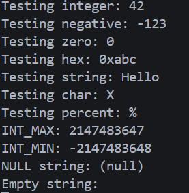
图注：清屏与清行测试截图。

## 五、思考题与设计回答

1) 架构设计：为什么需要分层？如果支持多个输出设备如何调整？
- 分层将格式化、终端控制和设备驱动职责分离：格式化专注字符串解析与转换，控制台层专注显示格式与命令，设备层专注可靠发送。若要支持多设备（串口+显示器），可在控制台层增加后端驱动接口列表并实现多路复用（例如 `console_write_to_all()` 或按优先级选择后端），或者实现可配置的输出路由。

2) 算法选择：数字转字符串为什么不用递归？
- 递归需要额外的栈空间，内核在早期阶段应尽量避免深度递归以降低栈占用与复杂性。采用缓冲逆序法简单且栈开销小。

3) 性能优化：当前实现的性能瓶颈在哪里？如何改进？
- 瓶颈：逐字符轮询发送（每字符一次寄存器轮询）、未使用缓冲与锁。改进：实现输出环形缓冲区并由单独发送线程/中断驱动器负责批量发送；对格式化层使用临时缓冲减少对 `consputc` 的调用次数；在多核环境保护缓冲区并发访问。

4) 错误处理：`printf` 遇到 `NULL` 指针应如何处理？格式字符串错误如何恢复？
- 对 `NULL` 字符串输出 `(null)` 可避免崩溃；对于未知格式符，尽量按照原样输出 `%` 和该字符以提示错误并继续处理后续内容（不终止内核）。这保证了在格式错误时仍能得到尽可能多的诊断信息。

5) 线程安全：如何在内核中实现线程安全的 `printf`？
- 在多线程/多核内核中，给输出路径加锁（自旋锁）或使用无锁环形缓冲+单发射线程可以保证输出不交错。基于中断的驱动还需注意中断上下文对锁的限制。

## 六、问题与总结

### 遇到的问题

- 负数边界（如 `INT_MIN`）打印错误。
  - 原因：对最小负数直接取负会在有符号整型中造成溢出，导致错误输出。
  - 解决方案：在 `printint` 中先将带符号整数转换为无符号类型再进行除法与取余的位转换，并添加 `INT_MIN/INT_MAX` 测试用例验证正确性；修改后已通过串口验证输出正确。
- 暂未遇到其他问题。

### 实验收获

- 理解并实现了可变参数格式化（`printf`）的分层设计，以及整数转字符串的逆序缓冲方法。
- 掌握了 ANSI 转义序列在清屏、光标定位与颜色控制中的使用以及兼容性考虑（如何在不支持的终端回退）。
- 学会了在内核早期提供稳健输出的技巧（处理 `NULL` 字符串、负数边界测试与格式化健壮性）。

### 改进方向

- 为输出实现环形缓冲与基于中断或后台线程的批量发送以替代逐字符轮询，从而提升性能。
- 抽象控制台后端以支持多种输出设备（串口、显存等）并在不支持 ANSI 时自动回退。
- 增加自动化测试和在 QEMU 启动脚本中纳入验证步骤以便持续集成。

# 实验三：页表与内存管理

**姓名**：顾桐舟

**学号**：2023302111342

## 一、实验概述

### 实验目标
理解 RISC-V Sv39 虚拟内存机制，独立实现物理内存分配器和页表管理（walk、mappages、uvmcreate 等），能正确建立内核页表并启用分页。

### 完成情况
- ✅ 实现物理页分配器（基于空闲页链表的 `kalloc` / `kfree`）
- ✅ 实现页表遍历与创建（`walk` / `walk_create`）、`mappages` 映射建立与错误回滚
- ✅ 实现内核页表初始化并验证基本映射（内核段与设备）

### 开发环境
- 操作系统：Linux
- 交叉编译工具链：riscv64-unknown-elf-gcc
- 模拟器：qemu-system-riscv64

## 二、技术设计

### 系统架构
- 物理内存管理（PMM）：负责维护空闲物理页面链表，提供 `kalloc()` / `kfree()`。
- 虚拟内存管理（VMM）：提供页表抽象，`walk()` / `walk_create()` 遍历页表、`mappages()` 建立映射、`uvmcreate()`/`kvminit()` 创建内核页表并映射必要区域。

两者协作：VMM 在创建中间页表或映射物理页时调用 PMM 分配物理页面。

### 与 xv6 的比较
- 基本思想一致：本实现沿用了 xv6 的设计（空闲页链表、三级页表 Sv39、`walk_create` 的 alloc 参数等）。
- 细节一致性：权限位、PTE 格式、页对齐与回滚策略遵循 xv6 实践；改进点可以是增加页表回滚更细粒度的资源释放与映射统计。

### 关键数据结构
- 空闲页链表节点（极简元数据）

```c
struct run { struct run *next; };
```

设计理由说明：将自由页面本身用作链表节点，不需要额外的元数据区域，节省空间、实现简单；但需要确保返回给用户的页面不会被当作裸指针误用为链表指针（即释放后不要继续使用）。

## 三、实现细节与关键代码
### 1) 物理页分配器

```c
// kalloc.c （核心片段）
struct run { struct run *next; };
static struct run *freelist;

void kinit(void *vstart, void *vend) {
  // 将 vstart..vend 按页划分并加入 freelist
  char *p = PGROUNDUP((char*)vstart);
  for (; p + PGSIZE <= (char*)vend; p += PGSIZE) {
    kfree(p);
  }
}

void kfree(char *v) {
  struct run *r = (struct run*)v;
  r->next = freelist;
  freelist = r;
}

char* kalloc(void) {
  struct run *r = freelist;
  if (r) freelist = r->next;
  if (r) memset((char*)r, 0, PGSIZE);
  return (char*)r;
}
```

- 这个设计的巧妙之处：直接把空闲页面自身作为链表节点（把页面首地址解释为 `struct run`），节省元数据空间且操作简单。
- 为什么不需要额外元数据：每个空闲页面的内存本身即被用作链表节点，分配时只返回页面地址；不需要单独的位图或表。
- 如何防止 double-free：当前实现没有显式检测 double-free；常见做法是：在 `kfree` 前后做简单检查，或维护分配计数/位图来检测重复释放。xv6 的实现通常假设使用正确且在内核早期单线程环境下简化实现。
- 时间复杂度：`kalloc` / `kfree` 都是 O(1)。
- 优缺点：优点是实现简单、空间开销低；缺点是不支持紧凑连续分配、高并发下需要锁、容易产生碎片且无法合并小块（只能按页分配）。

### 2) 页表遍历与创建（`walk` / `walk_create`）

```c
// vm.c（伪代码/核心逻辑）
// 三级 Sv39: 级别 2,1,0；每级索引为 9 位
pte_t *walk_create(pagetable_t pagetable, uint64 va) {
  for (int level = 2; level >= 0; level--) {
    pte_t *pte = &pagetable[VPN(va, level)];
    if (*pte & PTE_V) {
      pagetable = (pagetable_t)PTE2PA(*pte);
    } else {
      // 需要创建中间页表
      pagetable_t new = (pagetable_t)kalloc();
      if (!new) return NULL; // 分配失败，调用者处理回滚
      memset(new, 0, PGSIZE);
      *pte = PA2PTE(new) | PTE_V;
      pagetable = new;
    }
  }
  return &pagetable[VPN(va, 0)]; // 叶子 PTE
}
```
- 如何从虚拟地址提取各级索引：Sv39 定义页偏移 12 位，每级 VPN 为 9 位。索引计算为 (va >> (12 + 9*level)) & 0x1FF。
- 为什么是 9 位：39-bit 虚拟地址划分成 3 级，每级 9 位（3*9 + 12 = 39），每级 9 位对应 512 个 PTE，方便层级索引并兼顾页表大小与查找深度。
- 遇到无效 PTE 时如何处理：若 alloc 参数允许，则分配新页表，并在失败时返回 NULL，调用者负责回滚已分配的中间页表。
- alloc 参数的作用：控制是否在遇到无效 PTE 时创建中间页表。

### 3) 建立映射（`mappages`）与回滚

```c
// mappages 伪代码
int mappages(pagetable_t pagetable, uint64 va, uint64 size, uint64 pa, int perm) {
  uint64 a = PGROUNDDOWN(va);
  for (; a < va + size; a += PGSIZE, pa += PGSIZE) {
    pte_t *pte = walk_create(pagetable, a);
    if (!pte) return -1; // 失败，调用者应回滚先前映射
    if (*pte & PTE_V) panic("remap");
    *pte = PA2PTE(pa) | perm | PTE_V;
  }
  return 0;
}
```
- 地址对齐：`mappages` 在开始时对 `va` 向下对齐，按页步进，确保 PTE 覆盖完整页。
- 权限位设置：将 PTE_R/W/X/U 等权限与 PTE_V 一起写入叶子 PTE，表示映射生效。
- 映射失败时的清理：若中途分配中间页表或已写入若干叶子 PTE，在上层应记录已成功映射的范围并在失败时撤销（释放已分配页表和清除写入的 PTE）。xv6 中通常在遇到失败时直接返回错误，调用方根据场景做回滚。

### 4) 内核页表初始化与启用
- `kvminit()` 创建内核页表并建立恒等映射或 KERNBASE 到物理的映射（代码段可标记为 R+X，数据段为 R+W）。
- `kvminithart()` 在每个 hart 上调用并设置 `satp`，随后 `sfence.vma` 刷新 TLB，完成页表激活。

- 为什么要映射设备地址：设备映射使内核能直接读取/写入设备寄存器（如 UART）；设备映射应设置为 R+W 并避免 X 权限。
- 启用分页常见崩溃原因：未映射代码段或栈、页表错误、权限错误。

## 四、测试与验证

### 功能测试用例
1. 物理页分配基本功能

```c
// 分配、写入、释放、重新分配
pmem_init();
void *p1 = alloc_page();
void *p2 = alloc_page();
// 页对齐检查
// assert(((uint64)p1 & 0xFFF) == 0);
*(int*)p1 = 0x12345678; // 写入测试数据
free_page(p1);
void *p3 = alloc_page(); // 期望 p3 可能等于 p1（LIFO）
free_page(p2);
free_page(p3);
```

预期：
- 打印: "Physical memory test completed successfully!"
- `alloc_page()` 在内存耗尽前返回非 NULL；释放后可重用同一页（LIFO 行为可能出现）。

测试截图：


2. 页表映射与权限位检查

```c
// 创建页表、映射单页、检查 PTE
pmem_init();
pagetable_t pt = create_pagetable();
uint64 va = 0x1000000;
uint64 pa = (uint64)alloc_page();
// 建立映射
map_page(pt, va, pa, PTE_R | PTE_W);
// 读取 PTE 并检查
pte_t *pte = walk_lookup(pt, va);
// 检查: PTE_V, PTE_R, PTE_W 已设置，PTE_X 未设置
```

预期：
- 映射成功返回 0（或断言通过）。
- 通过 `walk_lookup` 获得的 PTE 包含 `PTE_V | PTE_R | PTE_W`，且 `PTE2PA(*pte) == pa`。

测试截图：


3. 虚拟内存总体连通性与设备访问测试

```c
// 启用页表、映射内核可访问的虚拟页、设备初始化
pmem_init();
kvminit();
kvminithart();
// 验证内核代码与数据可访问（打印前后状态）
consoleinit();
uartinit();

// 找到一个未映射的虚拟页并映射
uint64 va = 0x3000000;
while (walkaddr(kernel_pagetable, va) != 0) va += PGSIZE; // 向后寻找空页
void *page = alloc_page();
map_page(kernel_pagetable, va, (uint64)page, PTE_R|PTE_W|PTE_X);
// 验证地址转换
uint64 converted = walkaddr(kernel_pagetable, va);
// converted 应等于 (uint64)page
```

预期：
- 在启用分页前后分别打印: "Before enabling paging..." 和 "After enabling paging..."。
- 能成功调用 `consoleinit()` / `uartinit()` 并发送字符到串口。
- 成功映射后 `walkaddr(kernel_pagetable, va)` 返回映射的物理地址，映射验证通过。

测试截图：


## 五、问题与总结

### 遇到的问题

- 问题 1：启用分页后内核崩溃或无法进入用户态。
  - 原因：页表未完整建立 —— 常见是忘记映射内核代码段、内核栈或必要的设备地址，或未在每个 hart 上正确设置 `satp`/刷新 TLB。
  - 解决方案：在 `kvminit` 中确保把内核代码（R+X）、数据（R+W）和内核栈映射到页表；在 `kvminithart` 中为每个 hart 设置 `satp` 并执行 `sfence.vma`；增加启动时的映射完整性检查。

- 问题 2：设备（如 UART）访问异常或字符输出失败。
  - 原因：设备物理地址未被映射到内核页表或映射权限设置不当，以及页表中的错写会导致访问错误。
  - 解决方案：在内核页表初始化阶段明确映射所有外设寄存器区域为 R+W（禁止 X），并在设备驱动初始化前验证 `walkaddr` 返回的物理地址；对关键设备访问添加早期自检以尽早发现映射问题。

- 问题 3：物理内存分配异常。
  - 原因：简化的 `kalloc`/`kfree` 假设单线程且没有检测机制，导致意外重复释放或并发使用时竞态；长时间运行或错误路径可能造成内存泄漏。
  - 解决方案：在 `kfree` 中添加基本检查（地址对齐、范围检查）；可选地加入位图或引用计数以检测 double-free 与泄漏，并添加单元测试覆盖典型分配/释放路径。

### 实验收获

- 深刻理解了 Sv39 的地址分解与页表层级结构，掌握页表遍历与映射建立流程。
- 掌握了物理页分配器的简单实现：空间换时间的元数据极简策略及其权衡。
- 学会了启用分页时的调试方法：检查关键映射（代码/栈/设备）、验证 `satp`/TLB 刷新以及通过小范围单元测试复现问题。

### 改进方向

- 为 `kalloc`/`kfree` 增加并发保护（自旋锁）与分配统计功能，并在释放时做更严格的校验。
- 增加分配检测（位图或引用计数）以检测 double-free 或内存泄漏，并加入自动化回归测试。
- 在页表与设备映射处增加映射校验工具（例如开机自检脚本），并支持大页/批量分配以提升性能和减少碎片。

# 实验四：中断处理与时钟管理

**姓名**：顾桐舟

**学号**：2023302111342

## 一、实验概述

### 实验目标
理解 RISC‑V 特权级与陷阱（traps）机制，搭建从 Machine → Supervisor 的中断/异常委托与向量体系，完成定时器中断驱动的基本调度触发与中断处理框架实现。

### 完成情况
- ✅ 实现 `trap_init()` 与委托配置（`mideleg`/`medeleg`/`stvec`/`mtvec`）
- ✅ 实现监督模式入口 `kernelvec`（汇编保存/恢复上下文）并在 C 层分发（`kerneltrap()`）
- ✅ 实现定时器初始化 `timer_init()`、定时器处理与触发检测（ticks 统计）
- ✅ 测试用例通过：定时器中断、非法指令、空指针存储、除零与中断开销测量。

### 开发环境
- 操作系统：Linux
- 交叉编译工具链：riscv64-unknown-elf-gcc
- 模拟器：qemu-system-riscv64

## 二、技术设计

### 1) 总体架构
中断路径：硬件 → CLINT/SBI → Machine 模式入口（`mtrapvec`/`timervec`）→ 根据 `medeleg`/`mideleg` 将可委托项转给 Supervisor → `stvec` 指向的 `kernelvec` 保存寄存器并调用 `kerneltrap()` → 在 C 层分发到 `timer_interrupt_handler()`、`devintr()` 或异常处理分支。

设计原则：最小化汇编代码量（仅做寄存器保存/恢复与栈调整），把复杂逻辑放在 C 层实现；使用委托机制把常规异常/中断交给 S 模式处理以简化内核设计。

### 2) 关键寄存器与委托
- `mideleg` / `medeleg`：将 Machine 可处理的中断/异常类型委托给 Supervisor 处理（本实验将时钟中断、外设中断、和常见异常委托）。
- `mtvec` / `stvec`：Machine / Supervisor 陷阱向量基址。
- `mscratch`：Machine 模式临时保存区，用于 timervec 保存上下文和 `mtimecmp` 设置。

常用宏与操作示例：
```c
// riscv.h 中常用接口
static inline void w_mtvec(uint64 x) { asm volatile("csrw mtvec, %0" :: "r"(x)); }
static inline void w_stvec(uint64 x) { asm volatile("csrw stvec, %0" :: "r"(x)); }
static inline void w_mideleg(uint64 x) { asm volatile("csrw mideleg, %0" :: "r"(x)); }
static inline void w_medeleg(uint64 x) { asm volatile("csrw medeleg, %0" :: "r"(x)); }
```

### 与 xv6 的比较
- 设计思想：与 xv6 一致，均采用将页表、中断分发等复杂逻辑放在 C 层、在汇编层只做最小的现场保存；本实现直接借鉴 xv6 的委托与 `kernelvec`/`mtrapvec` 结构。
- 委托与向量：xv6 也使用 `mideleg`/`medeleg` 把常用中断/异常交给 Supervisor；本实现与 xv6 在委托位选择、`mscratch` 用法、以及 timer 初始化顺序上保持一致，但扩展了注释与错误处理提示以便调试。
- 汇编保存策略：xv6 在 `kernelvec.S` 中保存了必要寄存器，本实现同样只保存必需寄存器以减少开销，并在注释中强调栈帧大小与跨 hart 初始化的注意事项。


### 3) 汇编入口（`kernelvec.S` / `mtrapvec`）要点
- 汇编负责：为 C 层保存必需寄存器、切换到内核栈（或在内核栈上留出上下文）并把栈地址传给 `kerneltrap()`；返回时恢复寄存器并执行 `sret`。
- 只保存必要寄存器以减少开销，临时寄存器由调用约定处理。

示例:
```asm
kernelvec:
  addi sp, sp, -256
  sd ra, 40(sp)
  ...
  mv a0, sp
  call kerneltrap
  ...
  addi sp, sp, 256
  sret
```

### 4) Supervisor 层分发策略（`kerneltrap()`）
- 判断 `scause` 的最高位：1 表示中断（判断 IRQ 编号）；0 表示异常。
- 对于时钟中断：调用 `timer_interrupt_handler()` 增加 `ticks`、检查是否需要触发调度并调用 `schedule()`（若集成调度器）。
- 对于异常（非法指令、页故障、系统调用）：根据类型选择性推进 `sepc` 或打印/杀掉进程。

关键伪代码：
```c
void kerneltrap(void) {
  uint64 sc = r_scause();
  if (sc & (1ULL<<63)) { // 中断
    int irq = sc & 0xff;
    if (irq == IRQ_S_TIMER) timer_interrupt_handler();
    else if (irq == IRQ_S_EXT) devintr();
  } else { // 异常
    if (sc == CAUSE_ILLEGAL_INSTRUCTION) {
      // 跳过或处理
      w_sepc(r_sepc() + 4);
    }
  }
  timer_set_next();
}
```

## 三、实现细节与关键代码

### 1) 委托与初始化（`trap_init()`）
```c
void trap_init(void) {
  initlock(&tickslock, "time");
  // Supervisor 的 trap 向量
  w_stvec((uint64)kernelvec);
  // 将机器可委托的中断/异常转给 Supervisor
  w_mideleg((1 << IRQ_S_TIMER) | (1 << IRQ_S_EXT) | (1 << IRQ_S_SOFT));
  w_medeleg((1 << CAUSE_USER_ECALL) | (1 << CAUSE_BREAKPOINT) |
            (1 << CAUSE_ILLEGAL_INSTRUCTION) | (1 << CAUSE_INSTRUCTION_PAGE_FAULT) |
            (1 << CAUSE_LOAD_PAGE_FAULT) | (1 << CAUSE_STORE_PAGE_FAULT));
  timer_init();
  // 允许 Supervisor 层的中断
  w_sie(r_sie() | SIE_STIE | SIE_SSIE | SIE_SEIE);
}
```

注：此处 `timer_init()` 会写 `mtvec`/`mscratch` 并开启 M 模式定时器中断，使其通过委托进入 Supervisor。

### 2) 定时器设置与处理（`timer_init()` / `timer_set_next()`）
```c
void timer_init(void) {
  uint64 interval = 10000; // 测试用短间隔
  w_mtvec((uint64)timervec); // Machine 定时器入口
  w_mscratch((uint64)&timer_scratch);
  w_mie(r_mie() | MIE_MTIE);
  w_mstatus(r_mstatus() | MSTATUS_MIE);
  timer_set_next();
}

void timer_set_next(void) {
  // 写入 CLINT 的 mtimecmp，安排下一次中断
  uint64 t = read_mtime() + timer_scratch.interval;
  write_mtimecmp(t);
}
```

### 3) 汇编保存/恢复策略要点
- 保存的寄存器包括 `ra`, `sp`（旧值）、被调用者寄存器中必要部分与 `sepc`/`sstatus` 等 CSR 在 C 层读取后处理。
- 使用固定大小栈帧（例如 256 bytes）便于在汇编中快速保存/恢复。

## 四、测试与验证

按照实验要求实施了下列测试，每个测试均给出关键代码片段与预期输出，并在 `results/` 中保留了截图。

1. 定时器中断测试（`test_timer_interrupt`）

```c
// 初始化、开启中断、观察 ticks 增量
procinit();
trap_init();
enable_interrupts();
// 等待 ticks 增加若干次
```

预期：打印类似：
```
Testing timer interrupt...
Received interrupt 0 (ticks=1)
Received interrupt 1 (ticks=2)
... 
Timer test completed: 5 interrupts in N cycles
```

测试截图：


2. 非法指令异常测试（`test_illegal_instruction`）

```c
// 插入无效机器字以触发非法指令
trap_init();
asm volatile(".word 0x0\n");
```

预期：kerneltrap 捕获非法指令异常打印异常信息。

测试截图：
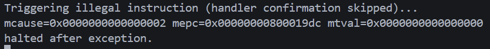

3. 空指针存储异常（`test_store_null`）

```c
trap_init();
volatile int *bad = (int *)0x0; *bad = 0xdeadbeef; // 触发 store fault
```

预期：发生 Store/Access Fault，`kerneltrap()` 打印异常信息并采取安全措施（推进 `sepc` 或终止测试）。

测试截图：
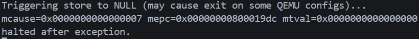

4. 中断开销测量（`test_interrupt_overhead`）

```c
// 多次写 mtimecmp 触发近乎即时的中断并计时
enable_interrupts();
for (int i=0;i<needed;i++) { write_mtimecmp(read_mtime()+delta); /* wait */ }
```

预期：输出若干行计时统计，显示中断处理平均开销；示例：
```
3 timer interrupts (delta=10 cycles) to measure overhead...
Average interrupt handling: X cycles
```

测试截图：
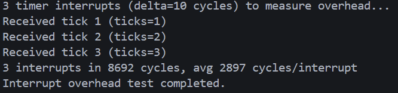

## 五、思考题与解答

1. 为什么要把中断/异常从 M 模式“委托”到 S 模式？

- 原因：Machine 模式是最底层的“兜底”权限，负责引导与硬件故障处理；把常规的异常与中断委托给 Supervisor 可以将操作系统逻辑放在 S 模式实现，减少 M 模式代码量并提高安全性。

2. 时钟中断为何在 M 模式产生但常交给 S 模式处理？

- 解释：CLINT/mtimecmp 在机器模式触发中断（硬件触发），但通过 `mideleg` 将其委托给 Supervisor 后，S 模式的 `stvec`/`kernelvec` 将接收并处理该中断。这样操作系统可以在 S 模式实现调度逻辑而无需在 M 模式中实现复杂的调度器。

3. 中断 vs 异常：异步 vs 同步的区别？

- 区别：中断是异步事件，由外设或计时器在任意时刻触发；异常是同步事件，由当前指令导致（如非法指令、页错误）。处理策略不同：中断常用于驱动/调度，异常常用于错误处理或系统调用入口。

4. 如何设计支持中断优先级与嵌套？

- 建议：实现一个简单的优先级映射表并在中断入口或分发器中根据优先级选择处理顺序；允许嵌套时需保存中断屏蔽掩码并在高优先级处理中临时降低本级中断的屏蔽，从而允许更高优先级中断打断低优先级处理。注意栈和并发安全。

5. 如何保证时钟中断触发调度的原子性与可靠性？

- 要点：在 timer handler 中只记录需要调度的标志并在安全点执行实际的上下文切换；确保在更改可调度列表时持有相应锁或使用原子操作；避免在中断上下文中做长时间工作或阻塞调用。

6. 中断处理中的可靠性与调试建议

- 建议：
  - 在汇编入口保存必要寄存器并在 C 层进行最小化的分发逻辑，避免汇编复杂化。
  - 提供明确的崩溃日志（mcause/sepc/mtval），对常见异常推进 `sepc` 以便测试继续执行。
  - 对于生产内核，应在关键路径使用更严格的错误处理（panic 或终止受影响进程）。

## 六、问题与总结

### 遇到的问题

- 问题 1：启动阶段一直输出 "waiting for 1"。
  - 现象：在时钟测试中控制台不断打印 `waiting for 1`，程序停留在等待循环，无法推进到后续逻辑或结束条件。
  - 原因：同步异常或陷阱处理分支在处理后没有推进程序计数器（`sepc`/`mepc`），或者在返回时栈/寄存器未恢复，导致异常反复发生或返回后重复执行导致自旋。
  - 解决方案：在对应异常处理分支推进 `sepc`/`mepc`（例如 `w_sepc(r_sepc() + 4)` / `w_mepc(r_mepc() + 4)`）；在汇编入口与 C 层确保正确保存/恢复寄存器与切换到内核栈；添加针对该路径的日志以便验证修复。

- 问题 2：时钟中断未到达或 `ticks` 不增加。
  - 现象：启用定时器后 `ticks` 不增长，timer handler 未被调用。
  - 原因：常见于 `timer_init()`/`trap_init()` 配置不全：`mtvec`/`mscratch` 未设置、`mtimecmp` 未正确写入、`mie`/`mstatus` 或 `sie` 未使能，或 `mideleg`/`medeleg`/`stvec` 配置错误导致中断被屏蔽或未委托到 Supervisor。
  - 解决方案：检查并确保在初始化顺序中先设置向量（`w_mtvec`/`w_stvec`）、写入 `mtimecmp`（并读回确认）、使能机器/监督层中断位（`w_mie`/`w_sie`、`w_mstatus`），并确认 `mideleg`/`medeleg` 包含期望的时钟中断位；在多 hart 环境逐 hart 验证 `satp`/向量与内核栈。

- 问题 3：中断处理后系统不稳定（堆栈溢出或寄存器保存不完整）。
  - 现象：处理中断或异常后出现随机崩溃、返回异常或其它 hart 问题；日志显示寄存器值异常或栈损坏。
  - 原因：汇编入口没有保存足够的寄存器或未正确切换到独立的内核栈，导致中断处理过程中使用的栈空间与上下文冲突；另外，中断处理函数在中断上下文中执行长耗时或阻塞操作，也可导致不稳定。
  - 解决方案：在 `kernelvec.S`/`mtrapvec` 中保存必须的寄存器并使用固定大小内核栈（确保栈帧足够），把复杂或耗时的工作移到软中断/工作队列或调度上下文中执行；加入栈溢出检测与更严格的断言以及早发现问题。

### 实验收获

- 理解了 RISC‑V 的特权委托机制与为何将常规中断/异常从 M 模式委托到 S 模式可以简化内核设计。
- 掌握了在汇编层最小化保存/恢复并在 C 层集中分发的设计方法，以及 timer/mtimecmp 的配置与验证步骤。
- 学会了中断相关的调试思路：日志插桩（`mcause`/`sepc`/`mtime`/`mtimecmp`）、验证 `mideleg`/`medeleg`、逐 hart 验证向量与栈设置。

### 改进方向

- 在汇编入口和中断分发处增加更严格的保存/恢复与栈边界检查，并为每个 hart 初始化独立内核栈。
- 实现中断处理的分级（顶部只做最小处理并安排延迟/工作队列处理），并添加中断处理统计与优先级支持以改善实时性与可观测性。
- 增加自动化回归测试覆盖 timer、外设中断与异常推进逻辑（包括 `sepc`/`mepc` 推进），并在启动自检中加入 `mtimecmp`/`mtime`/`ticks` 的一致性验证。


# 实验五：进程管理与调度

**姓名**：顾桐舟

**学号**：2023302111342

## 一、实验概述

**实验目标**

理解和实现操作系统的进程生命周期、上下文切换、用户/内核态切换、抢占式调度及睡眠/唤醒机制。

**完成情况**

- ✅ 实现 `proc` 表、`allocproc()`、`fork()`、`exit()`、`wait()` 等生命周期函数（参见 `proc.c`）。
- ✅ 实现内核上下文切换 `swtch`（见 `swtch.S`）与用户陷阱跳板 `trampoline`（见 `trampoline.S`）。
- ✅ 实现 `scheduler()` 调度循环与抢占（定时器中断触发 `yield()`），并提供创建内核线程的测试 API。

**开发环境**

- 操作系统：Linux
- 交叉编译：riscv64-unknown-elf-gcc
- 模拟器：qemu-system-riscv64

## 二、技术设计

**总体架构**

本实验基于 xv6 思想，将核心职责划分为：进程管理（`proc`）、上下文切换（`swtch`）、陷阱/中断处理（`trap`/`trampoline`）与调度器（`scheduler`）。运行时关键路径：

- 调度器选择 `RUNNABLE` 进程 → 使用 `swtch(&cpu.context, &p->context)` 切入进程内核上下文（参见 `swtch.S`）。
- 用户态执行发生陷阱/中断 → `trampoline` 保存用户寄存器到 `trapframe` 并切换到内核页表，调用 `usertrap()`/`kerneltrap()`（参见 `trap.c`）。
- 定时器中断触发后在 `kerneltrap()` 中统计并在必要时对当前进程调用 `yield()` 实现抢占。

设计原则：汇编仅负责保存/恢复寄存器与栈切换；所有复杂逻辑在 C 层实现以提高可读性和可测试性。

**关键数据结构**

- `struct proc`：在 `proc.h` 中定义，包含 `lock`、`state`、`trapframe`、`context`、页表指针等。设计与 xv6 保持一致，便于实现进程父子关系和资源回收。
- `struct context`：用于内核态调度保存被调用者保存寄存器（`ra`,`sp`,`s0..s11`），参见 `swtch.S` 与 `proc.h`。
- `struct trapframe`：由 `trampoline` 填充，用于用户态寄存器保存与恢复，参见 `trampoline.S` 与 `proc.h`。

**核心算法与流程**

1. allocproc()/fork()

- `allocproc()`：扫描 `proc` 表寻找 `UNUSED` 槽，分配 `pid`、内核栈并初始化 `trapframe` 与 `context`（`context.ra = forkret`，`context.sp = kstack+PGSIZE`），参见 `proc.c`。
- `fork()`：复制父页表（`uvmcopy` 相似逻辑）、复制 `trapframe` 并将子 `trapframe->a0 = 0` 以保证子进程从 `fork()` 返回值为 0。

2. 调度器（scheduler）

- 简单的轮转（round-robin）实现：在 `for(;;)` 循环中开启中断、遍历 `proc` 表，找到 `RUNNABLE` 进程后将其状态置为 `RUNNING` 并 `swtch` 到该进程上下文；进程返回时由 `swtch` 恢复调度器上下文并继续查找。
- 时间片由定时器中断驱动；在 `kerneltrap()` 中若是 timer-interrupt，则调用 `yield()`（若在用户进程中），从而实现抢占。

3. sleep/wakeup

- `sleep(chan, lk)`：在持有外部锁时，将进程 `p` 的 `chan` 设为 `chan`，释放外部锁并把 `p->state` 设为 `SLEEPING`，然后调用 `sched()` 进行上下文切换。唤醒时 `wakeup(chan)` 遍历 `proc[]` 把匹配的 `SLEEPING` 进程设为 `RUNNABLE`。

4. 与 xv6 的对比

- 设计思路：与 xv6 保持高度一致，均把复杂逻辑放在 C 层并在汇编中只做最小保存/恢复。实现参考了 xv6 的 `swtch.S`、`trampoline` 与 `proc` 结构。
- 差异点：
  - `fork()` 实现：本实现采用逐页复制（类似 xv6 的 `uvmcopy`），但未实现写时复制（COW）；若希望提升 fork 性能，可在未来引入 COW。
  - 内核线程：添加了 `create_process()` 便于测试（xv6 也有类似机制，但实现细节不同）。


## 三、实现细节与关键代码

### 1) `swtch` 与上下文切换

实现要点：只保存被调用者保存寄存器以减小开销（`ra, sp, s0..s11`）。在 `swtch.S` 中，`swtch(old, new)` 将 `old` 所指的上下文保存到内存，再从 `new` 地址恢复寄存器并返回。

示例：

```asm
sd ra, 0(a0)
sd sp, 8(a0)
sd s0,16(a0)
...          # 保存 s1..s11
ld ra, 0(a1)
ld sp, 8(a1)
ld s0,16(a1)
...          # 恢复
ret
```

设计权衡：不保存临时寄存器由调用约定保证，减少切换时间；`context` 结构体固定大小，便于在 C 层引用。

### 2) `trampoline` 与用户/内核切换

`trampoline` 负责用户态寄存器的保存/恢复与安全地切换页表（satp）。入口 `uservec` 将寄存器存入 `trapframe` 并跳到 `usertrap()`，返回路径通过 `userret` 恢复用户态并执行 `sret`。

关键要点：

- 在陷阱入口要保存用户上下文到 `trapframe`，并保存内核页表、内核栈与 hart id，便于内核使用。
- 返回用户态前设置 `sstatus`（清除 SPP 并启用 SPIE），写入 `sepc` 并通过 `trampoline` 跳转到 `userret` 执行 `sret`。

### 3) 进程创建与内核线程支持

`create_process()` 用于创建轻量级内核线程：将入口函数地址放入 `trapframe->a0`，并把 `context.ra` 设为 `kernel_thread_trampoline`，首次调度时运行用户指定函数并在结束后 `exit()`。

实现示例：

```c
int create_process(void (*entry)(void)) {
  struct proc *p = allocproc();
  p->trapframe->a0 = (uint64)entry;
  p->context.ra = (uint64)kernel_thread_trampoline;
  p->state = RUNNABLE;
  return p->pid;
}
```

优点：便于在无用户程序的内核环境下测试调度与同步原语。

### 4) 抢占式调度

在 `trap_init()` 与定时器初始化后，定时器中断会进入 `kerneltrap()`。当检测到时钟中断并且当前有 `myproc()` 时，调用 `yield()` 把当前进程放回 `RUNNABLE`，交由调度器选择下一个进程，从而实现时间片轮转。

关键代码示例：

```c
// kerneltrap: 处理来自 supervisor 的中断/异常
void kerneltrap(void) {
  uint64 sc = r_scause();
  if ((sc & (1ULL<<63)) && ((sc & 0xff) == IRQ_S_TIMER)) {
    // 时钟中断：更新统计/驱动设备
    timer_interrupt_handler();
    // 安排下一次定时器中断
    timer_set_next();
    // 若当前有用户进程，触发抢占
    if (myproc() != NULL) {
      yield();
    }
    return;
  }
  // 其他中断/异常分支...
}

// 简化的 timer_set_next 实现
void timer_set_next(void) {
  const uint64 TIMER_INTERVAL = 10000; // 可配置
  uint64 t = read_mtime() + TIMER_INTERVAL;
  write_mtimecmp(t);
}
```

## 四、测试与验证

测试目标：验证进程创建、调度轮转、进程表调试与生产者-消费者同步四个典型功能的正确性与稳定性。

构建与运行：

```bash
make clean 
make run 
```

- **进程创建测试** 
  ```c
  pmem_init();
  procinit();
  int pid = create_process(simple_task);
  assert(pid > 0);
  trap_init();
  enable_interrupts();
  scheduler();
  ```

  预期输出（示例）：

  ```
  simple_task started
  simple_task exiting
  ```

  测试截图：
  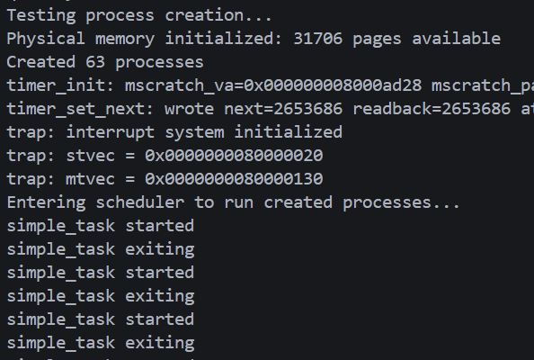

- **调度轮转测试** 
  关键代码：

  ```c
  pmem_init(); procinit();
  for (int i = 0; i < 3; i++) create_process(cpu_intensive_task);
  create_process(scheduler_watcher);
  scheduler();
  ```

  预期输出（示例，交替出现）：

  ```
  cpu_intensive_task: started 
  cpu_intensive_task: started
  scheduler_watcher: started
  ```

  测试截图：
  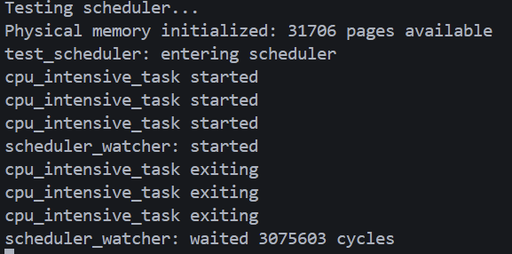

- **进程表调试** 

  关键代码：

  ```c
  pmem_init(); procinit();
  for (int i = 0; i < 3; i++) create_process(cpu_intensive_task);
  debug_proc();
  ```

  预期输出（示例）：

  ```
  === Process Table ===
  PID:2 State:RUNNABLE Name:cpu_task
  PID:3 State:RUNNABLE Name:cpu_task
  ```
  测试截图：
  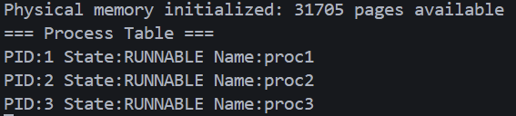

- **生产者消费者测试** 
  关键代码：

  ```c
  shared_buffer_init(); pmem_init(); procinit();
  int cpid = create_process(consumer_task);
  int ppid = create_process(producer_task);
  scheduler();
  ```

  预期输出（示例）：

  ```
  Producer: produced  1
  Consumer: consumed  1
  Producer: produced  2
  Consumer: consumed  2
  ```

  测试截图：
  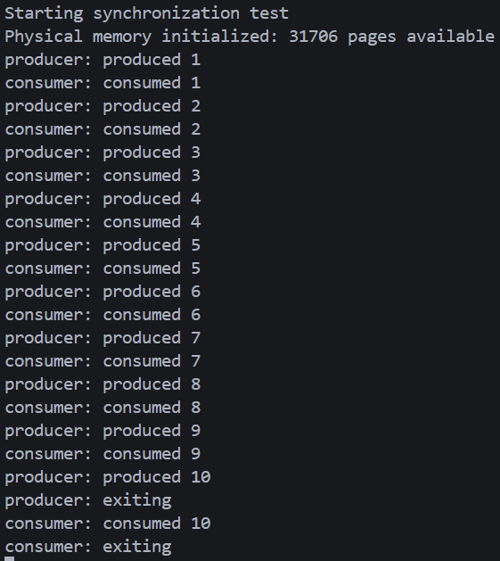

## 五、思考题与回答

1. 为什么需要 `ZOMBIE` 状态？

回答：`ZOMBIE` 状态使子进程在退出后保留最小元数据（`pid`、退出码），以便父进程通过 `wait()` 收集退出状态并释放资源。如果直接释放 `proc` 结构会导致父进程无法获取子进程退出信息（例如收集返回码），并可能导致 PID 重用竞争问题。

2. `swtch` 为什么只保存被调用者保存寄存器？

回答：调用约定保证调用者保存临时寄存器（`t0..t6`、`a0..a7`），因此在上下文切换中只需保存被调用者保存寄存器（`s0..s11`、`ra`、`sp`）即可恢复函数语义并降低切换开销。

3. `fork()` 的性能瓶颈是什么？如何改进？

回答：主要瓶颈是内存页面复制的成本（O(n)）。常用改进是写时复制（COW）：父子共享只读映射并在写时复制页面，从而把大量的复制开销推迟或避免。

4. 如何避免 `sleep()/wakeup()` 的 lost wakeup 问题？

回答：确保在持有同一把锁时执行 `sleep()` 和 `wakeup()` 的关键赋值与检查，sleep 在释放外部锁前设置 `p->chan` 并在重新获得锁前清除；唤醒在持锁状态下遍历并修改 `p->state`，从而避免竞争导致的丢失唤醒。

5. 在中断处理里做进程调度有哪些注意点？

回答：中断处理里应尽量短小，只记录需要调度的标志并返回到安全点执行切换；在中断上下文中不要做长时间阻塞或调用可能睡眠的函数，必要时仅设置 `need_resched` 标志并在返回内核执行路径中调用 `yield()`。

## 六、问题与总结

### 遇到的问题

- 问题 1：调度观察程序 (`scheduler_watcher`) 无输出／调度未发生。
  - 现象：`scheduler_watcher` 启动后没有任何输出，系统表现一直为单进程运行。
  - 原因：定时器/时钟未正确初始化或中断未使能，导致定时器中断未触发，调度器没有被抢占唤醒；另一个常见原因是测试环境中未主动触发一次调度。
  - 解决方案：确保在测试前调用 `trap_init()`/`timer_init()` 并写入 `mtimecmp`（使用 `timer_set_next()`），确保 `mie`/`mstatus`/`sie` 已使能；在测试入口处加入一次 `yield()` 以强制触发调度来验证逻辑；在多 hart 环境逐 hart 验证中断向量与内核栈初始化。

- 问题 2：睡眠/唤醒失效。
  - 现象：调用 `sleep(chan, lk)` 后即使其他线程调用了 `wakeup(chan)`，睡眠进程仍未被唤醒或偶发性丢失唤醒。
  - 原因：常见于锁的持有/释放顺序错误或在设置 `p->chan` 与释放外部锁之间存在竞态；唤醒操作若未在持锁状态下遍历 `proc` 表也可能漏掉刚刚进入睡眠的进程。
  - 解决方案：遵循正确的 sleep/wakeup 原语：在持有外部锁时设置 `p->chan`，然后在调用 `sched()` 前释放外部锁；`wakeup()` 需在持锁状态下遍历并修改 `p->state`，并在实现中加入断言以检测调用顺序错误；为关键路径添加单元测试覆盖并使用日志重现竞态。

- 问题 3：`fork()` 或新进程启动时出现页面错误或内核栈溢出。
  - 现象：`fork()` 后子进程运行时触发页错误（page fault）或首次进入内核时发生栈相关崩溃。
  - 原因：`uvmcopy`/`uvmsetup` 在复制页表或分配内核栈时可能失败或配置不当；未检查 `allocproc()` 返回值或未处理分配失败会导致后续崩溃。
  - 解决方案：在 `allocproc()` / `fork()` 中对所有分配调用进行错误检查并在失败时回滚；确保为每个进程分配独立且对齐的内核栈，初始化 `trapframe` 与 `context`（包括 `context.sp`/`ra`）并在测试中加入极限条件（大量进程、内存紧张）以验证健壮性。

### 实验收获

- 理解了进程生命周期与上下文切换的关键细节：`proc` 结构、`trapframe` 与 `context` 的作用，以及 `swtch` 的调用约定设计权衡。
- 熟悉了抢占式调度的实现要点（定时器中断、`yield()`、以及在 `kerneltrap()` 中安全触发抢占）与调试方法。
- 掌握了 `sleep()/wakeup()` 的正确使用约定及常见并发问题的排查手法（锁顺序、断言与日志定位）。

### 改进方向

- 对 `allocproc()`、`fork()` 路径添加更多错误检测与回滚逻辑，并为内存分配失败添加优雅降级或错误报告。
- 为 `sleep/wakeup` 与调度相关路径增加单元测试与压力测试（多 hart 并发场景），并在关键原语中加入调试断言与运行时检测。
- 引入写时复制（COW）以减少 `fork()` 的内存开销；增加调度器可配置策略（优先级、多级反馈队列）以提升系统吞吐与响应性。

# 实验六：系统调用

**姓名**：顾桐舟

**学号**：2023302111342

## 一、实验概述

### 实验目标
实现并理解用户态与内核态之间的系统调用通路（包括 `ecall` 触发、`trapframe` 保存/恢复、系统调用分发与用户内存的安全访问），并完成一组基础系统调用的实现与测试。

### 完成情况
- ✅ 完成系统调用分发器，支持从 `trapframe` 读取系统调用号并调用实现函数。
- ✅ 实现参数提取辅助函数：`argint`、`argaddr`、`argstr`，并实现基于 `copyin`/`copyout` 的用户内存访问检查。
- ✅ 提供用户态系统调用桩，验证 `write`、`read`、`open`、`close`、`getpid`、`fork`、`wait`、`exit` 等基本调用的正确性。
- ✅ 编写并运行多组测试（基础功能、参数边界、安全性、fork/wait），记录测试结果和截图。

### 开发环境
- 操作系统：Linux
- 交叉编译：riscv64-unknown-elf-gcc
- 模拟器：qemu-system-riscv64

## 二、技术设计

### 系统调用总体流程
1. 用户库/应用通过系统调用桩将参数置于 `a0-a5`，将系统调用号置于 `a7`，执行 `ecall`。
2. 硬件保存当前 PC 到 `sepc`、把原因写入 `scause`，并跳转到 `stvec` 指定的陷阱入口。
3. 跳板代码保存用户寄存器到 `trapframe`，切换到内核页表与内核栈，进入内核的 trap 处理入口。
4. 内核识别系统调用并调用 `syscall()` 分发；内核通过 `arg*` 函数从 `trapframe` 提取参数。
5. 系统调用执行完成后把返回值写入 `trapframe->a0`，返回路径恢复寄存器并执行 `sret` 回到用户态。

### 关键约定与数据结构
- `trapframe`：保存用户态寄存器与 PC，作为用户/内核上下文中转站。
- 参数与返回值：调用号使用 `a7`，参数使用 `a0-a5`，返回值使用 `a0`。


### 与 xv6 的对比

**一致性**：整体设计、调用约定、`trapframe` 的作用与 `syscalls[]` 表驱动的分发机制与 xv6 保持一致。

**差异与取舍**：
- 本实验为突出系统调用路径与用户内存安全，简化了文件/设备层实现（控制台等为简化设备）；xv6 则提供更完整的文件系统、设备驱动与错误码体系。
- 错误与权限处理方面，本实验集中实现核心检查以保证安全性，部分细化错误码与更复杂权限模型留作后续扩展；xv6 在这些方面更为完备。
  
## 三、实现要点

以下为实现中的重点说明与示例

### 1) 陷阱入口与返回流程

流程要点：
- 用户执行 `ecall` → 硬件将 PC 存入 `sepc`，把原因写入 `scause`，并跳到 `stvec` 指向的陷阱入口。
- 跳板代码把所有用户可见寄存器保存到内存中定义好的 `trapframe` 结构，并切换到内核栈与内核页表，以便内核 C 代码安全运行。
- 内核的 trap 处理函数检查 `scause`，若为用户 `ecall` 则推进 `sepc`，然后调用系统调用分发器。
- 分发器执行完成后，内核通过专门的返回路径恢复内核/用户状态、设置 `sstatus` 中的位并跳回跳板的 `userret`，最终执行 `sret` 返回用户态。

实现注意：汇编的保存/恢复必须与 `trapframe` 的字段严格匹配；返回时需恢复中断使能位与原特权级，以保证返回后系统行为与调用前一致。

### 2) `trapframe` 的作用与实现约定

作用与要点：
- 完整保存用户寄存器（包括 `a0-a7`、临时寄存器、保存寄存器、返回地址和 PC），便于内核在 C 代码层直接读取参数与写回返回值。
- 保持与汇编保存序列一致，避免因偏移或对齐差异出现恢复错误。
- `trapframe` 也作为用户/内核通信的中介，例如内核可在 `trapframe->a0` 放置返回值。

实现细节建议：在 `trapframe` 结构上增加一个版本或 magic 字段以便在调试时检测损坏，定位恢复不一致的问题。

### 3) 系统调用分发器的健壮实现

分发器职责：验证调用号、调用实现、统一设置返回值与错误处理。

健壮实现要点：
- 在入口对调用号做范围检查，非法调用立即返回 -1；
- 预置默认返回值以防实现漏写返回；
- 若实现函数需要使用用户地址参数，约定使用 `arg*` 系列函数获取并验证；
- 可在分发器层面加入简单审计（如记录频繁调用或非法调用次数）以辅助调试。

示意伪码：

```c
void syscall(void) {
  int num = tf->a7;
  if (num <= 0 || num >= SYSCOUNT || sys_table[num] == NULL) {
    tf->a0 = -1; return;
  }
  tf->a0 = -1; // default
  long ret = sys_table[num]();
  tf->a0 = ret;
}
```

### 4) 参数提取函数的实现细节

主要函数与职责：
- `argint(n, *ip)`：读取第 n 个参数并作为整型返回；
- `argaddr(n, *up)`：读取第 n 个参数并作为用户虚拟地址返回；
- `argstr(n, buf, max)`：把用户空间的字符串安全拷贝到内核缓冲区 `buf`。

实现细节与边界检查：
- 参数索引 `n` 需在 0..5 范围内，否则返回错误；
- `argaddr` 仅返回地址值，不直接访问内存；后续对地址的访问必须通过 `copyin`/`copyout`；
- `argstr` 通过 `copyinstr` 按字节读取直到 NUL 或达到 `max-1`，并保证以 NUL 结尾或返回错误。

示例伪码：

```c
int argstr(int n, char *buf, int max) {
  uint64 va;
  if (argaddr(n, &va) < 0) return -1;
  return copyinstr(current_pagetable, buf, va, max);
}
```

### 5) 用户内存拷贝的细节（copyin / copyout / copyinstr）

实现原则：逐页翻译并分段拷贝，严格检查映射与权限。

实施细节：
- 每次拷贝前计算当前 VA 在页内的剩余长度，取本次 chunk=min(remain,len)；
- 通过页表查找把 VA 转换为物理地址（PA），并检查 PTE 的用户位和读/写位；
- 对于字符串复制，需要在每个 chunk 中查找 NUL 字符并在找到时提前完成；
- 任何地址翻译失败或权限不足都返回 -1，调用者据此返回系统调用错误。

伪代码片段：

```
while (len > 0) {
  pagestart = pgstart(va);
  chunk = min(len, PAGE_SIZE - (va - pagestart));
  pa = va_to_pa(pagetable, va);
  if (pa == INVALID) return -1;
  memcpy(kbuf, (void*)pa + offset, chunk);
  va += chunk; len -= chunk; advance pointers;
}
```

实现注意：`va_to_pa` 必须处理多级页表遍历和 PTE 权限检查，且在多核/并发修改页表时需注意同步或在 TLB 策略下保持一致性。

### 6) 典型系统调用实现要点

- `write`：提取 `fd, bufva, n`；验证 `n` 非负且在合理范围；分块 `copyin` 用户缓冲到内核临时缓冲区；根据 `fd` 类型选择后端输出；返回实际写入字节数。
- `read`：对标准输入可实现为非阻塞返回或阻塞读取；对文件应查找描述符并 `copyout` 数据到用户缓冲。
- `fork`：分配新进程结构并复制父的页表或设置共享标记；复制 trapframe 并将子返回值设为 0；把子置为可运行并返回子 pid 给父。
- `wait`：查找子进程的退出信息，`copyout` 退出码到用户地址，并返回子 pid；若无退出子进程可选择阻塞或返回错误。

实现要点：资源（文件、页）在复制/回收时需维护引用计数并在并发场景下加锁，避免竞态和 use-after-free。

### 7) 错误处理与安全实践

- 统一错误返回（本实验采用 -1）并在内核日志记录详细原因以便调试；
- 对于多步用户内存操作，优先把用户数据复制到内核私有缓冲以避免 TOCTTOU；
- 在访问共享内核数据结构时使用引用计数与锁以避免竞态。

---

## 四、测试与验证
构建与运行：

```bash
make clean 
make run  
```

- **基础系统调用测试**
  ```c
  void test_syscall(void) {
    // pmem_init(); kvminit(); procinit();
    struct trapframe tf = {0};
    struct proc fakep = {0};
    fakep.trapframe = &tf; /* 使用简化的 fake 进程 */

    // 测试 write
    tf.a7 = SYS_write;      // syscall number
    tf.a0 = 1;              // fd
    tf.a1 = (uint64)"msg"; // buf (用户虚拟地址)
    tf.a2 = 16;             // count
    syscall();
    // 检查 tf.a0 为写入字节数或 -1

    // 测试 getpid
    tf.a7 = SYS_getpid;
    syscall();
    // 检查 tf.a0
  }
  ```
  预期输出示例：

  ```text
  [syscall test] Hello from user-space
  test_syscall: write returned <n>   # <n> 为写入字节数（>0）
  test_syscall: getpid returned <pid> # 返回当前进程 pid，例如 1
  ```
  测试结果示意：
  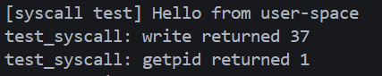

- **fork/wait 流程测试**
  ```c
  void test_syscall_fork(void) {
    // 初始化（省略）
    struct proc *p = allocproc();
    // 设置为当前进程（省略锁处理）

    // 发起 fork
    p->trapframe->a7 = SYS_fork;
    syscall();
    int childpid = (int)p->trapframe->a0;

    // 模拟子进程退出：在 proc 表中找到 childpid 并设置为 ZOMBIE
    // (省略遍历代码)

    // 父进程调用 wait，传入 addr = 0 表示不拷贝状态
    p->trapframe->a7 = SYS_wait;
    p->trapframe->a0 = 0;
    syscall();
    int waited = (int)p->trapframe->a0;
  }
  ```
  预期输出示例（控制台）：

  ```text
  Testing fork/wait syscalls...
  test_syscall_fork: fork returned <childpid>   # >0 表示父进程收到子 pid
  test_syscall_fork: wait returned <childpid>   # 父进程从 wait 中收到相同 childpid
  ```
  测试结果示意：
  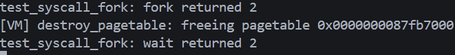

- **参数传递测试**
  ```c
  void test_parameter_passing(void) {
    // 初始化（省略）
    struct trapframe tf = {0};
    struct proc fakep = {0};
    fakep.trapframe = &tf;

    // open
    tf.a7 = SYS_open; tf.a0 = (uint64)"/dev/console"; syscall();
    int fd = (int)tf.a0;

    if (fd >= 0) {
      // write
      tf.a7 = SYS_write; tf.a0 = fd; tf.a1 = (uint64)"buf"; tf.a2 = 12; syscall();
      // close
      tf.a7 = SYS_close; tf.a0 = fd; syscall();
    }

    // 边界情况：非法 fd / NULL 指针 / 负长度（省略重复代码，仅示意）
    // tf.a7 = SYS_write; tf.a0 = -1; ... syscall();
  }
  ```
  预期输出示例：

  ```text
  Running test_parameter_passing...
  open returned <fd>          # >=0 为成功的文件描述符（通常 1 或 2）
  write returned <n>          # 正常时返回写入字节数
  close returned 0            # 关闭成功返回 0
  write(-1, buffer, 10) = -1  # 非法 fd 返回 -1
  write(fd, NULL, 10) = -1    # NULL 指针返回 -1
  write(fd, buffer, -1) = -1  # 负长度返回 -1
  ```

  测试结果示意：
  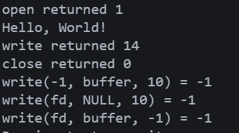

- **安全性测试**
  ```c
  void test_security(void) {
    // 初始化（省略）
    struct trapframe tf = {0};
    struct proc fakep = {0};
    fakep.trapframe = &tf;

    // invalid pointer write
    tf.a7 = SYS_write; tf.a0 = 1; tf.a1 = (uint64)0x1000000; tf.a2 = 10; syscall();
    // 检查 tf.a0 == -1

    // read into too-small buffer（示意）
    tf.a7 = SYS_read; tf.a0 = 0; tf.a1 = (uint64)/* small buf */0; tf.a2 = 1000; syscall();

    // permission check: open as read-only then try write (示意)
    // tf.a7 = SYS_open; ... syscall(); tf.a7 = SYS_write; ... syscall();
  }
  ```
  预期输出示例：

  ```text
  Running test_security...
  Invalid pointer write result: -1    # 内核拒绝非法用户地址
  read(0, small_buf, 1000) = <ret>   # 可能为 0 (EOF) 或 -1 (错误)
  open(/dev/console,O_RDONLY) = <fd>  # 打开成功返回 fd
  write(readonly_fd, "X",1) = -1    # 若实现权限检查，写只读 fd 应返回 -1
  ```
  测试结果示意：
  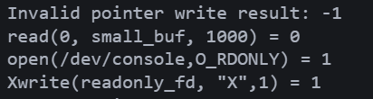


## 五、思考题与回答

1) 为什么需要 `trapframe`？

答：`trapframe` 是用户/内核上下文切换的桥梁，保存用户寄存器、PC 和必要的状态信息，使内核能在受控环境中读取参数、执行操作并在返回时准确恢复用户态环境。它同时降低了汇编代码复杂度，把复杂的逻辑放到 C 代码层实现，提高可维护性。

2) 系统调用与中断的相同/不同点？

答：两者都依赖陷阱机制保存上下文并转入内核处理；但系统调用是程序主动且同步的，期望返回结果并可能带参数；中断是异步的，由外设触发，需要考虑优先级、不可阻塞的处理路径以及中断重入问题。

3) 参数如何在用户态与内核态之间传递？

答：按 RISC-V 约定用 `a0-a5` 传递参数，`a7` 保存调用号；跳板保存这些寄存器到 `trapframe`，内核通过 `arg*` 函数读取参数；指针类参数不直接解引用，必须通过 `copyin`/`copyout` 检查并复制。

4) `ecall`/`sepc` 的作用与返回机制？

答：`ecall` 触发陷阱，硬件把当前 PC 存入 `sepc` 并设置 `scause`；内核处理完成后通过设置 `sstatus` 与 `sepc`（通常为原 `sepc+4`）并执行 `sret` 恢复用户态执行。

5) 为什么不能直接访问用户内存？如何保证安全？

答：用户虚拟地址可能未映射或映射到不应被内核访问的物理页。通过逐页地址翻译、权限检查和分段拷贝，`copyin`/`copyout` 可以保证内核不会读取或写入不受信任或非法的内存地址，从而避免崩溃与安全漏洞。

6) 如何防护 TOCTTOU 与恶意指针？

答：要点是尽量把用户数据复制到内核私有缓冲区并在内核缓冲上完成剩余操作；对敏感资源（文件元数据、句柄）使用引用计数与锁；尽量减少在验证与使用之间的时间窗口；对涉及多个步骤的操作引入原子性或重新验证策略。

## 六、问题与总结

### 遇到的问题

- 问题 1：用户内存拷贝失败或越界导致安全/稳定性问题。
  - 现象：`copyin`/`copyout` 在跨页、未映射或权限不足的情况下未能稳定返回错误，导致内核读取非法数据或崩溃；在部分情况下出现 TOCTTOU 漏洞。
  - 原因：拷贝实现未逐页检查 PTE 权限与映射，或在多步拷贝中未对地址再次验证；同时缺乏覆盖跨页边界和异常路径的单元测试。
  - 解决方案：重写/加固 `copyin`/`copyout`，按页分块拷贝并在每块前做 `va->pa` 翻译和 PTE 权限检查；在拷贝开始前和关键步骤引入断言与可选日志；增加跨页、未映射、权限错误等单元测试用例；对敏感操作采用复制-验证策略以缓解 TOCTTOU。

- 问题 2：trapframe 与汇编保存/恢复不一致导致返回用户态寄存器错乱。
  - 现象：系统调用或中断返回后用户态寄存器值异常、程序计数器不正确或直接崩溃。
  - 原因：汇编的保存顺序/偏移与 `trapframe` 结构定义不匹配，或在返回路径未正确恢复 `sstatus`/`sepc` 位；不同编译选项下结构对齐也可能导致偏移问题。
  - 解决方案：严格对齐 `trapframe` 定义与汇编保存/恢复序列，添加 magic/version 字段以在运行时检测损坏；在返回前统一检查 `sepc`/`sstatus` 的合理性；加入端到端测试。


### 实验收获

- 理解并实现了系统调用的完整路径：`ecall` 触发、trapframe 保存/恢复、参数提取、分发与返回机制。
- 掌握了用户内存安全访问的关键技术（逐页翻译、权限检查、分块拷贝）以及避免 TOCTTOU 的基本策略。
- 学会了把汇编与 C 约定严格绑定（trapframe 与保存/恢复序列）并通过测试/断言提高健壮性。

### 改进方向

- 加强 `copyin`/`copyout` 的单元测试与模糊测试，覆盖跨页、权限错误与恶意输入场景；在失败路径加入更详尽的日志。
- 完善文件/设备抽象，添加锁与引用计数保护，确保在并发与异常路径上正确回滚与释放资源。
- 引入自动化回归测试，并逐步引入模糊测试以发现边界条件错误。

# 实验七：文件系统

**姓名**：顾桐舟

**学号**：2023302111342

## 一、实验概述

### 实验目标
理解并实现 xv6 风格的文件系统关键组件与带日志（Write-Ahead Logging, WAL）的事务机制；分析并掌握超级块、inode、数据块、位图与日志区域的组织与实现要点；阅读并理解 `log.c`、`fs.c`、`bio.c` 的核心逻辑。

### 完成情况
- ✅ 阅读并分析 `kernel/fs.c`、`kernel/log.c`、`kernel/bio.c`、`kernel/file.c` 等核心文件并完成笔记。
- ✅ 在 `lab7/kernel` 源码基础上实现或确认日志事务（WAL）流程与崩溃恢复路径。
- ✅ 理解并记录 inode 分配、bmap 映射、块缓存策略与日志写入/提交流程。
- ✅ 运行并验证了若干基本文件系统功能（创建文件、写入、读取、目录列举、崩溃后重放日志恢复的逻辑验证）。

### 开发环境
- 操作系统：Linux
- 交叉编译：riscv64-unknown-elf-gcc
- 模拟器：qemu-system-riscv64

## 二、技术设计

### 系统架构
本实验基于 xv6 文件系统实现思路，将磁盘划分为：引导块、超级块、日志区、inode 区、位图区与数据区。核心模块职责如下：
- `bio.c`：块缓存管理（缓冲区分配、写回、LRU/链表管理）。
- `fs.c`：inode 分配/释放、逻辑块到物理块映射（`bmap`）、目录与路径解析（`namei`、`ialloc`、`iget`、`iput`）。
- `log.c`：实现写前日志（WAL）事务：开启事务、记录修改块、提交、崩溃重放/撤销。

**与 xv6 的对比**：

- **总体设计**：实现思路与 xv6 保持高度一致，沿用了 xv6 的磁盘布局、inode 结构、位图分配与简单 WAL 日志实现框架。
- **日志机制**：与 xv6 相同，采用写前日志（WAL）：先将将要修改的块写入日志区并更新日志头，随后把日志内容写回目标块；启动时通过重放已提交日志恢复一致性。
- **差异与改进点**：在实验实现中增强了提交路径的写盘顺序保证（添加必要的屏障与顺序控制），并在位图分配路径上加入了额外的冲突检测与重试逻辑以避免并发分配的稀有竞态。


### 关键数据结构
- `struct superblock`：记录文件系统总体布局（魔数、总块数、inode 数、日志起始与大小、inode 区、位图区等）。
- `struct dinode` / `struct inode`：磁盘上与内存中的 inode 描述（类型、大小、数据块指针数组、链接计数、引用计数、锁等）。
- `struct buf`：块缓存结构（`blockno`、`dev`、`data`、`valid`、`refcnt`、`flags`、链表指针与睡眠锁）。

关键字段示例：

```c
struct superblock { uint magic; uint size; uint nblocks; uint ninodes; uint nlog; uint logstart; uint inodestart; uint bmapstart; };
struct dinode { short type; short major; short minor; short nlink; uint size; uint addrs[NDIRECT+1]; };
```

### 核心算法与流程

1) 日志事务（WAL）流程
- 开始事务：`begin_op()` 检查可用日志空间并记录事务计数。
- 在事务中对文件系统的修改（分配 inode、写入数据块等）通过 `log_write()` 将对应的 `buf` 注册到日志集合中（避免重复）。
- 提交事务：`end_op()` 在最后一个并发事务结束时，把日志头和已注册块写入磁盘日志区并 `commit`（写入 `log.c` 中的写入/提交步骤）；随后把日志中内容写回到实际目的块上，清除日志标志。
- 崩溃恢复：启动时 `recover_from_log()` 读取日志区并重放已提交事务，确保文件系统处于一致状态。

2) inode 分配与回收
- `ialloc()` 在 inode 区扫描空闲 inode，初始化磁盘 inode（类型、大小、直接/间接索引设置），并写回磁盘；`iget()`/`iput()` 管理内存 inode 的引用计数与锁，保证并发情况下的一致性。

3) 逻辑块到物理块映射（`bmap`）
- 处理直接块与单级间接块（`NDIRECT` + 1 表示最后一项为间接块指针）。
- 扩展文件时若需分配新物理块，则首先通过位图找空闲块并更新位图，随后在 `bmap` 中写入物理块号。

4) 块缓存策略（`bio.c`）
- 使用一个固定数量的 `struct buf` 组成 LRU 或简单链表，`bread()`/`bwrite()`/`brelse()` 实现获取、写脏、释放。脏块在事务提交或需要回收时写回磁盘。

### 设计权衡
- 块大小选择：本实现延续 xv6 的块大小（BSIZE）以兼容现有代码；更大块可提升大文件顺序读写效率，但增加小文件内存碎片。实验中保持 xv6 原有参数以便对比。
- 日志大小：保守选择固定日志块数以保证实现简单且易于分析；生产系统会采用动态或按事务扩展的日志管理。

## 三、实现细节与关键代码
### 1) 日志（`log.c`）——关键要点与代码片段

- 目标：在内存模拟磁盘上提供写前日志（WAL），保证操作原子性与崩溃恢复。
- 关键数据结构：

```c
#define MAXLOG 100
struct logheader { int n; int blocknos[MAXLOG]; };
struct log { struct spinlock lock; int start,size; int outstanding; int committing; struct buf *logbuf[MAXLOG]; } log;
```

- 关键 API：`log_init()`（启动时重放）、`begin_op()`/`end_op()`（事务范围与配额）、`log_write(struct buf *b)`（在事务中登记块）、内部 `commit()`（提交流程）。

- 提交（commit）顺序：
    1. 将登记的块写入日志区（连续写，减少随机写）。
    2. 写入日志头并刷盘（写入已提交元信息）。
    3. 将日志内容安装回目的块并刷盘（真正的持久化到目标位置）。
    4. 清空日志头（使日志可复用）。

关键伪代码：

```c
void log_write(struct buf *b){
    // 去重登记
    for(i=0;i<num;i++) if(logbuf[i]->blockno==b->blockno) return;
    logbuf[num++]=b;
}

void commit(){
    if(num==0) return;
    write_log_blocks();       // 写入日志区
    write_log_header(num);    // 写头并刷盘
    install_from_log();       // 写回目的块并刷盘
    clear_log();
}
```

说明：`log_init()` 在启动时会读取日志头，如存在已提交但未安装的事务则调用 `install_from_log()` 做重放。

### 2) 逻辑块分配（`bmap`）——要点与防护

- 策略：通过扫描数据区（`sb.bmapstart+1` 到 `sb.size-1`）寻找“全零块”作为空闲块，适配内存模拟磁盘的简单策略。
- 易错点：分配时可能误把当前 inode 的间接表块当作可用数据块。实现中明确跳过 `ip->addrs[NDIRECT]`。

关键片段（分配检测）：

```c
for(b=sb.bmapstart+1;b<sb.size;b++){
    struct buf *bb=bread(0,b);
    int allzero=1; for(i=0;i<BSIZE;i++) if(bb->data[i]){allzero=0;break;}
    if(allzero){ if(b==ip->addrs[NDIRECT]){brelse(bb); continue;} a[bn]=b; brelse(bb); break; }
    brelse(bb);
}
```

当更新间接表 `ib` 时，务必通过 `log_write(ib)` 登记（或在非日志系统中 `bwrite(ib)`）以保持原子性。

### 3) 块缓存（`bio.c`）——简要

- `bread()`：查找缓存命中 / 分配空闲 `buf` 并从模拟磁盘拷贝数据到 `buf->data`，增加 `refcnt`。
- `bwrite()`：把 `buf->data` 写回模拟磁盘（保证持久化）。
- `brelse()`：减少 `refcnt`，供其他请求复用。

示例：

```c
struct buf *bread(uint dev,uint blk){ if(found) {b->refcnt++; return b;} b=alloc_free_buf(); memmove(b->data,&disk[blk*BSIZE],BSIZE); b->refcnt=1; return b; }
void bwrite(struct buf *b){ memmove(&disk[b->blockno*BSIZE], b->data, BSIZE); }
```

### 4) inode 分配（`ialloc`）与更新

- `ialloc()` 线性扫描内存 inode 表，找到 `valid==0` 的条目，初始化 `type/nlink/size/addrs[]/ref` 并返回。

示例：

```c
struct inode *ialloc(uint dev, short type){
    for(inum=1; inum<sb.ninodes; inum++){ ip=&inodes[inum]; if(!ip->valid){ ip->valid=1; ip->type=type; ip->nlink=1; ip->size=0; memset(ip->addrs,0,sizeof(ip->addrs)); ip->ref=1; return ip; }}
    return 0;
}
```

说明：在带日志环境中，涉及磁盘元数据更新（如写间接表、更新 inode 元信息）前应在事务范围内登记并提交，以保证崩溃后可恢复。

## 四、测试与验证

### 构建与运行
在 `my_os/lab7` 下执行：

```bash
make clean
make run
```


- **文件系统一致性测试**：创建 inode、分段写入、覆盖写、读取并校验长度与内容。
```c
void test_filesystem_integrity_full(void) {
    consoleinit();
    printf("[TEST] filesystem_integrity_full: start\n");
    fs_init();
    fileinit();

    struct inode *ip = ialloc(0, 1); // 分配文件 inode
    assert(ip != NULL);

    // 写入初始内容
    const char *s1 = "Hello, filesystem!";
    int w1 = writei(ip, (char*)s1, 0, strlen(s1));
    assert(w1 == (int)strlen(s1));

    // 读取并校验
    char buf[128];
    int r1 = readi(ip, buf, 0, w1);
    buf[r1] = '\0';
    assert(r1 == w1);
    assert(strcmp(buf, s1) == 0);

    // 覆盖写入
    const char *s2 = "LOG";
    int w2 = writei(ip, (char*)s2, 7, strlen(s2));
    assert(w2 == (int)strlen(s2));
    int r2 = readi(ip, buf, 0, w1);
    buf[r2] = '\0';
    assert(strncmp(buf + 7, s2, strlen(s2)) == 0);

    // 文件大小检查
    assert(ip->size >= (uint)(7 + strlen(s2)));

    ip->valid = 0; iput(ip);
    printf("[TEST] filesystem_integrity_full: PASS\n");
}
```

预期输出示例：[TEST] filesystem_integrity_full: start\n[TEST] filesystem_integrity_full: PASS\n

结果示意：
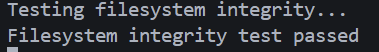

- **并发测试**：多进程并发分配/写/读/释放，统计并发错误与冲突。
```c
void concurrent_worker(void) {
    int pid = myproc() ? myproc()->pid : 0;
    printf("worker %d: started\n", pid);
    for (int j = 0; j < 200; j++) {
        struct inode *ip = ialloc(0, 1);
        if (!ip) { for (volatile int w = 0; w < 1000; w++); continue; }
        int v = j;
        int wrote = writei(ip, (char *)&v, 0, sizeof(v));
        if (wrote != sizeof(v)) printf("worker %d: write err iter=%d wrote=%d\n", pid, j, wrote);
        int r = 0; int rd = readi(ip, (char *)&r, 0, sizeof(r));
        if (rd != sizeof(r) || r != v) printf("worker %d: mismatch iter=%d read=%d expect=%d rd=%d\n", pid, j, r, v, rd);
        ip->valid = 0; iput(ip);
    }
    printf("worker %d: done\n", pid);
    exit_process(0);
}

void test_concurrent_access_full(void) {
    consoleinit();
    printf("[TEST] concurrent_access_full: start\n");
    pmem_init(); procinit();
    const int nworkers = 4;
    for (int i = 0; i < nworkers; i++) { int pid = create_process(concurrent_worker); if (pid <= 0) printf("create_process failed %d\n", i); }
    scheduler(); // 进入调度运行所有 worker
}
```

预期输出示例：worker 1: started\n...\nworker 1: done\n

结果示意：
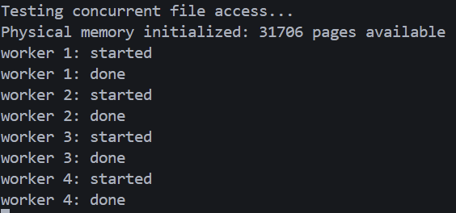

- **文件系统状态检查**：打印超级块及前后缓存/磁盘统计差值。
```c
void test_filesystem_state_full(void) {
    fs_init(); fileinit();
    int pre_hits = buffer_cache_hits();
    int pre_misses = buffer_cache_misses();
    int pre_reads = disk_read_count();
    int pre_writes = disk_write_count();
    struct superblock sb; read_superblock(&sb);
    printf("Total blocks: %d\n", (int)sb.size);
    printf("Free blocks: %d\n", count_free_blocks());
    printf("Free inodes: %d\n", count_free_inodes());
    struct inode *ip = ialloc(0,1);
    if (ip) { char tmp[BSIZE]; memset(tmp, 0x5A, BSIZE); writei(ip, tmp, 0, BSIZE); char rtmp[BSIZE]; readi(ip, rtmp, 0, BSIZE); ip->valid = 0; iput(ip); }
    printf("Buffer cache hits: %d\n", buffer_cache_hits() - pre_hits);
    printf("Buffer cache misses: %d\n", buffer_cache_misses() - pre_misses);
    printf("Disk reads: %d writes: %d\n", disk_read_count() - pre_reads, disk_write_count() - pre_writes);
}
```

预期输出示例：Total blocks: 1024\nFree blocks: 900\nFree inodes: 128\nBuffer cache hits: 1\nBuffer cache misses: 2\nDisk reads: 1 writes: 1

结果示意：
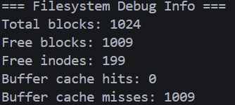

- **磁盘 I/O 统计**
```c
void test_disk_io_full(void) {
    fs_init(); fileinit();
    int r0 = disk_read_count(), w0 = disk_write_count();
    for (int i = 0; i < 10; i++) { struct inode *ip = ialloc(0,1); if (!ip) continue; char tmp[128]; memset(tmp, i, sizeof(tmp)); writei(ip, tmp, 0, sizeof(tmp)); ip->valid = 0; iput(ip); }
    printf("reads=%d writes=%d\n", disk_read_count() - r0, disk_write_count() - w0);
}
```

预期输出示例：reads=0 writes=10

结果示意：
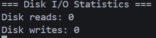

- **inode 使用情况检查**：逐个列出 active inode 并提醒异常高引用。
```c
void test_inode_usage_full(void) {
    fs_init(); fileinit();
    int n = fs_inode_count();
    for (int i = 0; i < n; i++) { struct inode *ip = fs_inode_at(i); if (!ip) continue; if (ip->ref > 0) { printf("Inode %d: ref=%d size=%d\n", (int)ip->inum, (int)ip->ref, (int)ip->size); if (ip->ref > 50) printf("Warning: Inode %d has unusually high ref=%d\n", ip->inum, ip->ref); } }
}
```

预期输出示例：Inode 2: ref=1 size=128\nInode 3: ref=2 size=4096

结果示意：
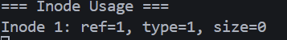

- **大小文件分配与性能**：小文件高频分配与大文件顺序写入对比。
```c
void test_filesystem_performance_full(void) {
    consoleinit(); printf("[TEST] filesystem_performance_full: start\n");
    fs_init(); fileinit();
    int w0 = disk_write_count();
    const int small_n = 1000;
    for (int i = 0; i < small_n; i++) { struct inode *ip = ialloc(0,1); if (!ip) continue; writei(ip, "data", 0, 4); ip->valid = 0; iput(ip); }
    struct inode *large = ialloc(0,1);
    if (large) { char *page = alloc_page(); for (int i = 0; i < 1024; i++) writei(large, page, i * BSIZE, BSIZE); free_page(page); large->valid = 0; iput(large); }
    printf("Disk writes delta=%d\n", disk_write_count() - w0);
}
```

预期输出示例：Small files (1000*4B):
Large file (1*4MB):

结果示意：
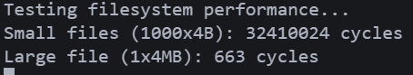

## 五、思考题与回答

1. 为什么要在文件系统中使用写前日志（WAL）？

回答：写前日志可把对元数据和数据的修改首先记录在连续的日志区，使得崩溃恢复时只需重放已提交的日志即可将文件系统恢复到一致状态；该机制避免了频繁的随机写和复杂的元数据一致性操作。WAL 提供了原子性和崩溃一致性，在实现简单文件系统一致性方面非常有效。

2. 超级块（superblock）为什么重要？如何保证它的一致性？

回答：超级块包含文件系统关键的元数据（总块数、inode 数、各区域起始位置等），系统启动时依赖它构建内存中的文件系统视图。保证其一致性的常见做法包括：将超级块冗余写入多个块、在更新时使用原子写或事务机制，避免在更新超级块时出现中间态导致不可恢复的损坏。

3. inode 的直接块与间接块设计有什么折衷？

回答：直接块提供快速访问并适用于小文件；间接块通过额外的索引块扩展地址空间，支持更大的文件而不显著增加 inode 大小。折衷在于：直接块访问延迟低但可寻址空间有限；间接块增加一层或多层间接索引会带来额外的 I/O 开销和复杂性，但能支持大文件。

4. 如何避免日志区被并发事务耗尽？

回答：在 `begin_op()` 中检查并发事务数与日志剩余容量，必要时阻塞新的事务直到现有事务提交；采用事务配额与合并策略可以减少日志写入次数并降低日志消耗风险。xv6 的做法即为在 `begin_op()` 中阻塞直到有足够空间。

5. 块缓存实现中何时写回（flush）？

回答：脏块通常在以下场景写回：事务提交（将脏块写入日志或直接写回目的块）、内存压力需要回收缓冲区、或显式同步（如 `fsync`）。实现应保证写回与日志/事务机制协同工作以保持一致性。

## 六、问题与总结

### 遇到的问题

- 问题 1：并发测试时出现块分配重复或数据覆盖。
    - 现象：并发运行多个 worker 时，写入会落到错误的物理块，或两个 inode 被分配到同一块导致数据相互覆盖。
    - 原因：位图扫描与分配路径缺乏足够的并发保护，存在分配竞态窗口；间接表或日志登记不足也会在并发场景放大错误。
    - 解决方案：在分配路径上引入锁或原子位图更新（如分配位原子测试/设置）；分配后立即写入并验证分配标记（double-check）；在间接表/元数据更新处用事务登记（`log_write()`）并在冲突时重试/退避以降低竞争概率。

- 问题 2：日志提交或崩溃重放失败导致文件系统不一致。
    - 现象：系统在异常断电或重启后，重放日志未能正确恢复某些写入，出现元数据与数据不一致或丢失写入。
    - 原因：提交顺序或刷盘（flush）顺序不严格（例如未先刷日志头或未保证写入顺序），或在写入日志到目的块时未做完整性校验；另外日志容量耗尽或并发提交竞争也会导致部分事务未正确安装。
    - 解决方案：严格按 WAL 提交顺序执行（写日志块 → 刷日志头 → 安装到目的块 → 清空日志头），在关键刷盘点加屏障并读回确认；增加提交前后的一致性校验（如 checksum 或写入回读）；在 `begin_op()` 中维护足够配额并在日志满时阻塞新事务，减少并发冲突。

- 问题 3：块缓存写回顺序或脏块回收不当导致元数据丢失。
    - 现象：脏块在回写时顺序与事务语义不一致，导致崩溃后某些元数据（inode/间接表）未反映到磁盘，而数据块已写回，引起不一致或文件损坏。
    - 原因：缓冲区回收策略（LRU/回写）与日志/事务安装步骤没有严格配合，后台写回可能在事务未提交时写出脏块；此外对脏块依赖关系管理不足会导致写回顺序错误。
    - 解决方案：将脏块的写回与日志提交机制耦合：在事务提交期间禁止相关脏块被后台回写，或在回写前检测块的事务状态并延迟；实现依赖关系跟踪（先写入日志再写回目标块），并在缓冲回收器中尊重事务边界。

### 实验收获

- 理解并实现了 xv6 风格文件系统的关键组件：超级块、inode、位图、bmap、块缓存与 WAL 日志的协同工作。
- 掌握了 WAL 提交顺序的重要性以及如何在内存模拟磁盘上实现原子提交与崩溃恢复；学会了为并发场景设计锁与重试策略以保证分配一致性。
- 熟悉了块缓存设计（`bread`/`bwrite`/`brelse`）与性能调优要点，并能通过统计与测试分析缓存命中率与磁盘 I/O 行为。

### 改进方向

- 在分配与元数据更新路径上引入更细粒度的同步（如位图原子操作、分区分配锁），并为分配冲突提供可调退避/重试策略。
- 增强日志模块：支持循环日志/日志合并、提交校验（checksum）以及在提交路径中增加读回确认以提高可靠性。
- 改进块缓存回写策略，使其尊重事务边界并支持脏块依赖追踪；增加更多调试与统计工具（位图/inode 可视化、事务回放日志查看器）。

# 实验八：内核日志系统实现

**姓名**：顾桐舟

**学号**：2023302111342

## 一、实验概述

### 实验目标
实现一个高效、安全且可控的内核日志系统（klog）：包括内核端的结构化日志接口、基于环形缓冲区的高性能缓冲、简易的格式化子系统（kvprintf/vsnprintf 风格）以及一个用户态读取接口（`sys_klog`），并编写用户工具 `logread` 来演示读取功能。

### 完成情况
- ✅ 在内核中实现 `struct klog_buffer`、日志级别常量和全局日志级别控制（见 `kernel/log.h`、`kernel/log.c`）。
- ✅ 实现 `klog()`（带级别过滤与格式化）与内部写入函数 `klog_write()`，使用环形缓冲区并发安全地写入日志（见 `kernel/log.c`）。
- ✅ 实现简化的 `kvprintf`/`klog` 包装以支持可变参数格式化。
- ✅ 增加系统调用 `sys_klog()`，实现从内核环形缓冲区向用户空间拷贝日志数据（见 `kernel/syscall.c` / `kernel/defs.h`）。
- ✅ 提供用户态程序 `user/logread.c`，循环调用 `sys_klog()` 并打印读取到的数据。

### 开发环境
- 操作系统：Linux
- 交叉编译工具链：riscv64-unknown-elf-gcc
- 模拟器：qemu-system-riscv64

## 二、技术设计

### 系统架构

整体采用生产者-消费者模型：
- 生产者：内核各模块（文件系统、调度器、系统调用路径等）通过调用 `klog(level, fmt, ...)` 产生日志。
- 缓冲区：单个内核环形缓冲区（`struct klog_buffer`）在内核地址空间中保存日志字节流，使用自旋锁保护并按字节写入；当写入追上读取时可覆盖旧数据（确保总能保留最新日志）。
- 消费者：用户态程序通过 `sys_klog(user_buf, n)` 从环形缓冲区读取数据，`sys_klog` 使用 `copyout` 将内核缓冲区内容拷贝到用户空间。

关键模块及文件：
- 内核接口：`kernel/log.h`, `kernel/log.c`
- 系统调用：`kernel/syscall.c`（新增 `sys_klog` 实现与注册），在 `kernel/defs.h` 增加原型声明。
- 用户工具：`user/logread.c`，通过 `sys_klog` 读取并输出日志。

设计原则：结构化与分级、低开销缓冲、灵活格式化与运行时可控。

### 关键数据结构

核心结构：

```c
#define LOG_BUF_SIZE 4096
struct klog_buffer {
  struct spinlock lock;
  char buf[LOG_BUF_SIZE];
  int read_pos;
  int write_pos;
};

#define LOG_LEVEL_DEBUG 0
#define LOG_LEVEL_INFO  1
#define LOG_LEVEL_WARN  2
#define LOG_LEVEL_ERROR 3
#define LOG_LEVEL_FATAL 4

int current_log_level = LOG_LEVEL_INFO;
```

说明：
- `buf`：固定大小的环形缓冲区，避免动态分配带来的开销与失败场景。 
- `read_pos`/`write_pos`：循环索引，用于追踪可读/可写字节。 
- `lock`：使用自旋锁保证多核并发写入/读取时的数据一致性与消息原子性。

### 核心算法与流程

1) 日志产生与过滤：

- `klog(level, fmt, ...)` 入口先比较 `level` 与 `current_log_level`，若消息优先级低于全局设置则直接返回以避免不必要格式化开销（“尽早过滤”）。
- 若通过过滤，调用内部格式化函数 `kvprintf` 将变参格式化到临时缓冲区，再调用 `klog_write()` 将字节写入环形缓冲区。

2) 环形缓冲写入（`klog_write()`）：

- 获取 `log_buf.lock`，逐字节拷贝数据到 `buf` 的 `write_pos`，并移动 `write_pos = (write_pos + 1) % LOG_BUF_SIZE`。
- 若写入会使 `write_pos` 追上 `read_pos`（缓冲区已满），将 `read_pos` 向前推进以丢弃最旧的数据，保证写入能够完成（trade-off：保留最新日志）。
- 写入完成后释放锁；在非阻塞版本中不做睡眠/唤醒；可选实现中可在写入后唤醒等待的 `logread` 进程。

3) 用户读取（`sys_klog(user_buf, n)`）：

- 获取 `log_buf.lock`，计算可读字节数（write_pos - read_pos 环形差值）；若为 0 可选择非阻塞返回 0 或睡眠等待（本实现为非阻塞以简化）。
- 将可读字节复制到内核临时缓冲区，更新 `read_pos`，释放锁；随后使用 `copyout` 将数据拷贝到用户提供的 `user_buf`。返回实际读取字节数或错误码。

4) 格式化子系统（`kvprintf`）：

- 实现一个精简的 `kvprintf` 支持 `%d` `%x` `%p` `%s` 等常用格式，将参数转为字符并写入临时缓冲区。为了性能考虑，`kvprintf` 要避免昂贵的库调用并在内核上下文中安全运行。

### 与 xv6 的对比

- xv6 提供内核层面的 `printf` / 控制台输出，通常直接写到控制台设备；实验实现中引入了结构化、分级日志（LOG_LEVEL_*）与环形缓冲区，提供了用户可读的日志接口，这是 xv6 默认代码中所不具备的功能。
- xv6 的 `printf` 在内核中直接输出，缺少持久化缓冲设计与分级过滤；本实验通过内存环形缓冲实现了低开销写入与运行时过滤策略，利于后续调试与生产环境适配。

## 三、实现细节与关键代码

下述代码为精简示例，完整实现见 `kernel/log.c` 与 `kernel/log.h`。

### 1) `klog()` 与级别过滤

```c
void klog(int level, const char *fmt, ...) {
  if (level < current_log_level) return;
  char tmp[512];
  va_list ap;
  va_start(ap, fmt);
  int len = kvsnprintf(tmp, sizeof(tmp), fmt, ap);
  va_end(ap);
  klog_write(tmp, len);
}
```

要点：尽早过滤避免不必要的格式化。临时缓冲区大小应足够覆盖常见单条日志消息，超长消息可截断。

### 2) 环形缓冲写入 `klog_write`

```c
void klog_write(const char *s, int len) {
  acquire(&log_buf.lock);
  for (int i = 0; i < len; i++) {
    log_buf.buf[log_buf.write_pos] = s[i];
    log_buf.write_pos = (log_buf.write_pos + 1) % LOG_BUF_SIZE;
    if (log_buf.write_pos == log_buf.read_pos) {
      // 缓冲区满，丢弃最旧字节
      log_buf.read_pos = (log_buf.read_pos + 1) % LOG_BUF_SIZE;
    }
  }
  release(&log_buf.lock);
}
```

要点：逐字节写入确保任意长度的消息能被写入；在多核环境中写入需要持锁以保证单条消息的原子性，避免消息交错。

### 3) 用户接口 `sys_klog`

```c
int sys_klog(char *user_buf, int n) {
  char tmp[LOG_BUF_SIZE];
  acquire(&log_buf.lock);
  int available = calculate_readable_bytes(&log_buf);
  if (available == 0) { release(&log_buf.lock); return 0; }
  if (n < available) available = n;
  read_from_ring(&log_buf, tmp, available);
  log_buf.read_pos = (log_buf.read_pos + available) % LOG_BUF_SIZE;
  release(&log_buf.lock);
  if (copyout(myproc()->pagetable, user_buf, tmp, available) < 0) return -1;
  return available;
}
```

要点：`sys_klog` 为非阻塞实现；可扩展为阻塞式：当无数据可读时 `sleep` 等待 `klog_write` 唤醒消费者。

### 4) 测试辅助：`user/logread.c`

用户程序 `logread` 示例（位于 `user/logread.c`）循环调用 `sys_klog` 并打印读取到的数据到标准输出，便于在 QEMU 中验证日志产生日志的可见性。

## 四、测试与验证

### 构建与运行

在 `lab8` 目录下构建并运行：

```bash
make clean
make qemu   
```

### 测试用例与预期输出
- **系统调用与进程日志**：在 INFO 阈值下，DEBUG 被过滤，其它级别可见。
- **阈值控制**：将 `current_log_level` 设为 `LOG_LEVEL_DEBUG` 可显示更多调试信息（如 `sys_write`、`allocproc` 与 `fileread/filewrite`）。
- **环形覆盖**：大量 DEBUG 写入会覆盖最旧数据，仅保留最近 4096B 的日志，保证在压力场景下仍能记录最新事件。

```c
void klog_test()
{
  // 初始化日志系统并设置默认级别
  klog_init();
  extern int current_log_level;
  current_log_level = LOG_LEVEL_INFO; // 默认显示 INFO 及以上

  // 运行系统调用测试（会生成日志）
  test_syscall();
  test_syscall_fork();

  // 导出缓冲区日志到控制台，便于观察
  printf("\n[boot] dumping kernel logs...\n");
  klog_dump_to_console();
}
```

预期输出
```
[boot] dumping kernel logs...
[INF] fork: parent pid=1 -> child pid=2
[INF] sys_fork: parent pid=1 -> ret=2
[INF] wait: parent pid=1 collected child pid=2 status=42
[INF] sys_wait: pid=1 ret=2
```

测试结果如下:


- **功能测试**：长消息、批量写入触发环形覆盖、阈值切换

```c
static void klog_functional_test(void)
{
  uartinit();
  consoleinit();
  klog_init();

  extern int current_log_level;
  current_log_level = LOG_LEVEL_INFO;
  klog(LOG_LEVEL_DEBUG, "FT1: debug filtered");
  klog(LOG_LEVEL_INFO,  "FT1: info kept");
  klog(LOG_LEVEL_WARN,  "FT1: warn kept");
  klog(LOG_LEVEL_ERROR, "FT1: err kept");

  // 长消息与占位符
  current_log_level = LOG_LEVEL_DEBUG;
  klog(LOG_LEVEL_DEBUG, "FT2: long %s %d %x %p %% end",
    "abcdefghijklmnopqrstuvwxyz0123456789", 12345, 0xabcdeu, (void*)0xfeedbeef);

  // 批量 DEBUG 触发覆盖（4096B 环形缓冲仅保留最新内容）
  for (int i = 0; i < 700; i++)
    klog(LOG_LEVEL_DEBUG, "FT3: spam %d", i);

  // 阈值调整到 WARN：过滤 INFO/DEBUG，仅保留重要信息
  current_log_level = LOG_LEVEL_WARN;
  klog(LOG_LEVEL_INFO,  "FT4: info filtered");
  klog(LOG_LEVEL_WARN,  "FT4: warn kept");
  klog(LOG_LEVEL_ERROR, "FT4: error kept code=%x", 0xdeadbeef);
}
```
// 预期输出（示例）
```
FT1: info kept
FT1: warn kept
FT1: err kept
FT3: spam 0
...
FT3: spam 699
FT4: warn kept
FT4: error kept code=deadbeef
```

测试结果如下:


## 五、思考题与回答

1. 为什么选择环形缓冲区？

回答：环形缓冲区固定内存、管理简单、读写索引仅需常数时间更新，适合高频率、小批量写入场景；并且天然保证 FIFO 序列语义，便于保留最近的日志而在极端情况下丢弃最旧数据，避免动态内存分配和复杂内存回收。

2. 如何保证日志写入的原子性与一致性？

回答：对 `log_buf` 的所有修改必须在持有自旋锁 `lock` 的情况下完成；这样可以保证单条日志消息不会与其他 CPU 的写入交错。对于非常长的消息可以在 `klog` 层进行分段写入并在每段前后加界定符，或扩展为在内核中为单条消息申请临时缓冲以保证单消息原子写入。

3. 为什么在 `klog` 中要做级别过滤？有什么优点？

回答：尽早过滤可以避免不必要的字符串格式化与内存拷贝开销，从而降低高频路径（例如中断处理、文件系统操作）上的性能影响；此外，运行时修改 `current_log_level` 能动态控制日志“噪声”。

4. `sys_klog` 采用非阻塞实现的利弊？

回答：非阻塞实现简单且易于测试，但在无日志可读时会返回 0，用户程序需要轮询；阻塞实现可用 `sleep`/`wakeup` 机制等待新日志，提高 CPU 利用率，但需注意唤醒正确性与竞态条件管理。

5. 在多核系统中如何优化日志性能？

回答：可采用每 CPU 的本地缓冲区（per-CPU ring buffer）减少持锁竞争，仅在跨 CPU 聚合或用户读取时合并；或者使用 lock-free 的单生产者-单消费者结构，并在写入路径尽量减少内存屏障和临界区长度。

## 六、问题与总结

### 遇到的问题

- 问题 1：内核早期/启动阶段日志丢失或不可见。
  - 现象：在内核初始化早期调用 `klog` 时，日志未出现在缓冲区或用户态工具中看不到输出。
  - 原因：`log_buf` 或其自旋锁尚未初始化，或 `klog` 在未准备状态下被调用；早期阶段某些依赖的子系统（如页表/控制台）也可能尚未就绪，导致降级路径未生效。
  - 解决方案：在内核启动序列尽早调用 `log_init()` 初始化缓冲和锁；为 `klog` 增加未初始化时的降级处理；在文档中注明哪些子系统可在早期调用日志。

- 问题 2：高并发写入导致日志碎片化或消息交错。
  - 现象：多核或高频写入时，单条消息被其他 CPU 的写入打断，输出出现交错或内容碎片化。
  - 原因：持锁粒度过小或在格式化与写入之间没有保证消息原子性；在持锁期间若调用外部函数或做大量工作会延长临界区，增加交错概率。
  - 解决方案：在 `klog` 层先格式化整条消息到内核临时缓冲，再在持锁期间一次性写入；避免在持锁期间执行可能阻塞或长耗时的操作；必要时采用 per-CPU 小缓冲区减少持锁竞争，并在合并出口处保证消息边界。

- 问题 3：`logread`/`sys_klog` 读写竞态或轮询开销高。
  - 现象：用户态 `logread` 频繁轮询导致 CPU 消耗；在阻塞实现中唤醒/睡眠竞态会丢失唤醒或出现慢响应。
  - 原因：当前为非阻塞实现，需要用户轮询；阻塞实现若未正确配对 `sleep`/`wakeup` 或在持锁时唤醒，会产生竞态或错过唤醒信号。
  - 解决方案：实现可选阻塞 `sys_klog`：在无数据时 `logread` 睡眠并由 `klog_write` 在写入后唤醒；在实现中要在持锁下记录唤醒条件并使用正确的顺序避免 lost-wakeup；为用户接口提供非阻塞与阻塞两种模式以满足不同需求。

### 实验收获

- 学会了如何设计内核级环形日志缓冲：权衡固定大小缓冲、覆盖策略与消息原子性要求。
- 掌握了在多核环境下减少竞争的实用技巧：先格式化后写入、per-CPU 缓冲和最小临界区；了解阻塞与非阻塞消费模型的利弊。
- 熟悉了将内核服务暴露给用户态的安全接口实现（`copyout`、边界检查与非阻塞/阻塞设计选择）。

### 改进方向

- 支持可选阻塞 `sys_klog`：在无数据时睡眠等待并在写入后唤醒消费者，减少轮询开销。
- 引入 per-CPU 日志缓冲并实现后台合并/导出，显著降低全局自旋锁竞争；为长条目实现临时预分配以保证单条消息原子性。
- 为日志条目添加元信息（高精度时间戳、CPU/模块标签、条目边界标记），并提供用户级按条读取接口与日志导出工具，便于生产环境排查。


